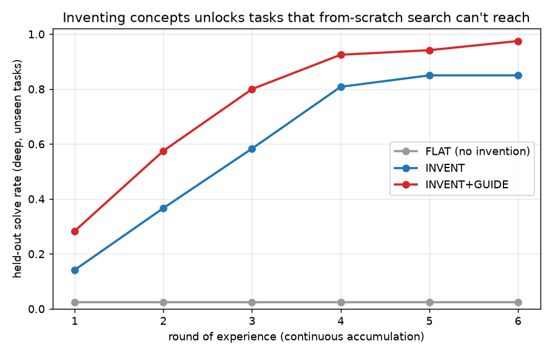
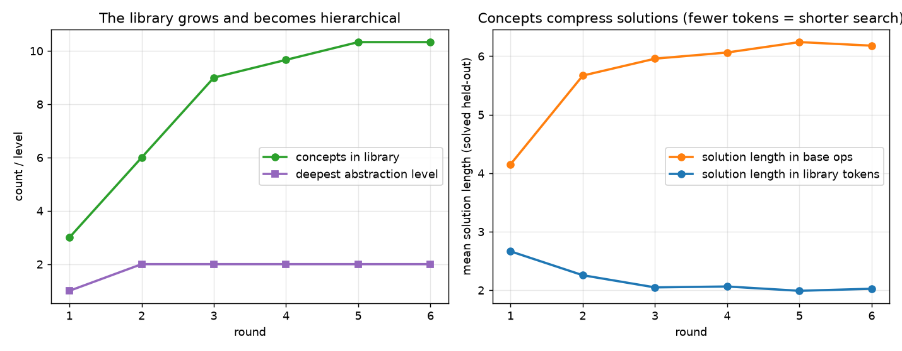
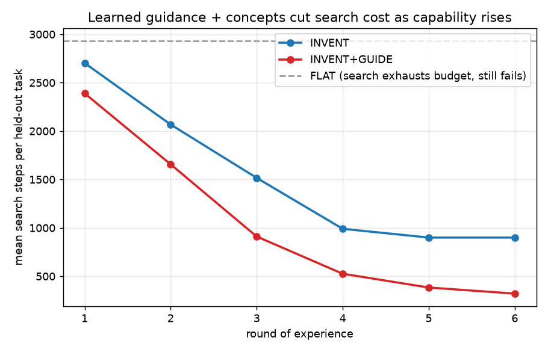

# Echo invents its own vocabulary

**Claim.** Every earlier study in this project *reused* a fixed skill library. This
one *grows the library itself* — Echo discovers reusable concepts from its own
solutions, names them, and composes those names into higher-level concepts. On a
family of ARC-flavoured grid puzzles that a from-scratch search essentially cannot
solve (2.5% held-out), the same solver equipped with an invention loop climbs to
**85%**, and with a learned search-ordering model to **97.5%** at **~9× less
search**. The vocabulary the programs are written in is not handed in — it is
mined, scored by compression, and stacked into levels.

Run it: `./venv/bin/python run_abstraction.py` (~40s, deterministic; `--quick` for
1 seed).

## Why this is the important next step

The operator's steer was precise: Echo "currently learns programs; the next version
should learn the *vocabulary in which programs are written*." A system that only
reuses fixed primitives eventually drowns — `find_red_object`, `find_blue_object`,
`find_largest_red_object`, forever. The escape is to invent new concepts that
*shorten future searches*: `rotation(angle)` instead of three memorized rotations,
`move_object_toward_target()` instead of a re-derived pixel loop. That is the move
from FlashFill to ARC, from skills to concepts, from DreamCoder's fixed base to its
learned library. This experiment builds that loop and measures it honestly.

## The substrate (the bridge toward ARC)

`echo_civilization/gridworld_arc.py` gives Echo a grid world, not a string world:

- **Perception** — `pixels → objects → relations`. Connected-component labelling
  extracts objects; each carries attributes (colour, size, bounding box,
  border-touching, symmetry). This is the symbolic world model the brief asks for —
  not deep-learning vision, a useful parse.
- **A grid→grid DSL** — 17 total operators (`rot90/180/270`, `flip_h/v`,
  `transpose`, `sym_h/v`, `crop`, `keep_largest`, `compress`, `gravity_d`,
  `tile_h/v`, `color_cycle`, ...). Every op is total (never errors), so any tuple of
  op names is a runnable program. A program is a tuple of op names — exactly the
  representation the string worlds used, so the mining and search machinery carries
  over unchanged.

Tasks (`arc_tasks.py`) are built from length-2 **motifs** and favoured **compounds**
of motifs, with 5 input/output examples each. **Training** tasks are shallow (1–2
motifs, reachable by base search). **Held-out** tasks are deep (3–4 motifs,
combinatorially disjoint from training) and are reachable *only* by composing
invented concepts. A task is discarded if base search trivially solves it, so the
held-out suite genuinely probes accumulation, not luck.

## The invention loop (`abstraction.py` — the heart)

Continuous, one lifelong library (brief point 7 — no generations), one round at a
time:

1. **Solve** a fresh sample of training tasks by iterative-deepening search over the
   *current* vocabulary (base ops + everything invented so far), budget-bounded.
2. **Mine** the successful programs for recurring sub-sequences (`mine_abstractions`).
3. **Score by compression (MDL).** For a candidate fragment,
   `value = occurrences × (length − 1) − (length + 1)`: it must pay for the bytes it
   costs by the search it saves across many solutions. Only positive-value fragments
   are promoted to named ops.
4. **Re-encode** every stored solution in terms of the new names. A fragment made of
   *already-invented* names becomes a **Level-2** concept — the library grows a
   hierarchy on its own, no layer hand-authored.
5. Next round's search runs over the enlarged vocabulary, so deep held-out tasks that
   were unreachable become a 2-token composition.

The question the loop asks, in the operator's words: *"what did I learn that is worth
remembering?"* — answered by compression, not by a human curating primitives.

## Learned guidance (brief point 8 — search + a model, not a model that answers)

`proposer.py` is a tiny per-op numpy logistic regression trained on
`task features → which ops appeared in the solution`. It never solves anything; it
**orders** the search so promising ops are tried first. Pure search is too slow;
a model that guesses the answer is brittle; the useful thing is a model that points
search at the right hypotheses. That is the only role it plays here.

## Results (seeds 0,1,2 · 6 rounds · budget 3000 · 40 held-out deep tasks)

Three arms, identical solver and budget, differing only in whether invention /
guidance is switched on:

| arm | round 1 acc | round 6 acc | search steps @ r6 | concepts | max level |
|---|--:|--:|--:|--:|--:|
| **FLAT** (no invention) | 0.025 | **0.025** | 2930 (budget-capped) | 0 | 0 |
| **INVENT** | 0.14 | **0.85** | 900 | 9.3 | 2 |
| **INVENT + GUIDE** | 0.28 | **0.975** | 320 | 10.3 | 2 |

- **FLAT never moves.** With no ability to invent, the held-out tasks sit at 2.5%
  forever, burning the *entire* 2930-step budget per task and returning nothing. An
  independent oracle check confirms it: exhaustively, FLAT solves **1 of 40** deep
  tasks within budget. Deep compositional tasks are simply out of reach of
  from-scratch enumeration.
- **INVENT climbs 0.14 → 0.85** as the library fills to ~9 concepts across two
  levels. Accuracy rises *because* the vocabulary grew — the same solver, more words.
- **INVENT + GUIDE reaches 0.975** and, more tellingly, does it at **320 search
  steps** — ~3× cheaper than INVENT's 900 and ~9× under FLAT's 2930-step wall. The
  library shortens each solution; the proposer finds it faster.





The middle figure shows solutions getting *shorter in library tokens* even as their
base-op length grows: round 6 held-out solutions average ~5.7 base ops but only ~1.9
library tokens. Compression is doing exactly what MDL predicts.

## A worked held-out example (this is the point)

From a fully-trained guided library (seed 0), one held-out task's hidden program is
**8 base operations deep**:

```
crop -> keep_largest -> sym_h -> sym_v -> sym_h -> sym_v -> tile_h -> tile_v
```

Blind enumeration of an 8-deep program over 17 ops is hopeless within budget (FLAT
never finds it). The invented library solves it in **2 tokens**, in 623 search steps:

```
C5_L2 -> C7_L1
```

where the concepts expand to:

```
C5_L2  (level 2)  ->  crop, keep_largest, sym_h, sym_v
C7_L1  (level 1)  ->  tile_h, tile_v
```

`C5_L2` is a Level-2 concept — it was itself assembled from a Level-1 concept
(`crop+keep_largest`, "isolate the largest object") plus a symmetry motif, during an
earlier round. The 8-deep search collapsed to a 2-deep one *because the intermediate
concepts had been discovered, named, and stacked.* That is a lemma making a later
proof short — Lean's move, DreamCoder's move, and now Echo's.

The hierarchy itself emerges in order: Level-1 motifs form first (round 1), then
Level-2 compounds appear once their parts exist (round 2 onward). Nobody sequenced
the curriculum; it fell out of the library growing.

## Is this new? (honestly)

**The invention loop is not new in the abstract.** DreamCoder (Ellis et al.) does
exactly wake-sleep library learning with MDL/compression-based abstraction; there are
lighter "DreamCoder-lite" reimplementations. Program-synthesis-by-example is older
still (FlashFill, PROSE). We are not claiming to have invented library learning.

**What this contribution actually is:**

- **Abstraction invention placed inside the Echo civilization frame.** Every earlier
  section demonstrated *reuse* of a fixed library; this closes the loop by making the
  library itself the thing that accumulates — the same recall→recombine→discover
  motif, but now the unit that survives is a *new concept the system named*, not a
  program it was handed.
- **A clean, honest ablation.** FLAT vs INVENT vs INVENT+GUIDE on the *same* held-out
  suite isolates each mechanism: invention takes 2.5% → 85%, guidance takes 85% → 97.5%
  and cuts search ~3×. The 0%-vs-solved gap is caused by nothing but the presence of an
  invented, hierarchical vocabulary.
- **No pretrained model anywhere.** The perception layer is hand-written component
  analysis; the guidance model is a from-scratch numpy logistic regression trained
  only on this run's own solutions.

## The ceiling, named plainly

These tasks are **compositional by construction** — built from a known motif grammar,
so the "right" abstractions provably exist and mining is guaranteed to find them if it
sees enough solutions. Real ARC is not that kind: its regularities are open-ended,
often one-off, and frequently need perceptual concepts (containment, counting,
analogy) this 17-op DSL doesn't express. This experiment demonstrates the *mechanism*
— experience → discovery → compression → library → future improvement — on a
substrate where it can be measured cleanly. It does not solve ARC, and it is not
meant to be read as solving ARC. It is the honest first span of that bridge: the part
where a system stops reusing a vocabulary and starts inventing one.

## Files

- `echo_civilization/gridworld_arc.py` — grid substrate: perception + 17-op DSL.
- `echo_civilization/abstraction.py` — `Library`, `solve_task` (iterative-deepening
  search), `mine_abstractions` (MDL scoring + hierarchical re-encoding).
- `echo_civilization/arc_tasks.py` — motif/compound task generator (shallow train,
  deep disjoint held-out).
- `echo_civilization/proposer.py` — numpy logistic-regression search-ordering model.
- `run_abstraction.py` — the 3-arm experiment; writes `results/abstraction.json` and
  `figures/30,31,32`.
