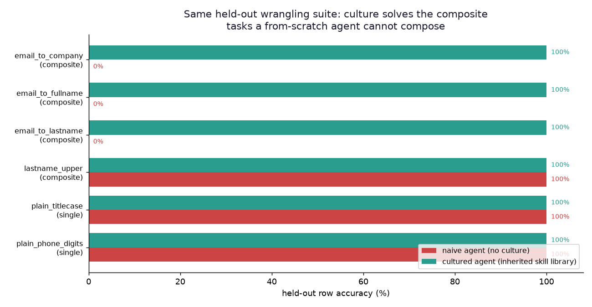
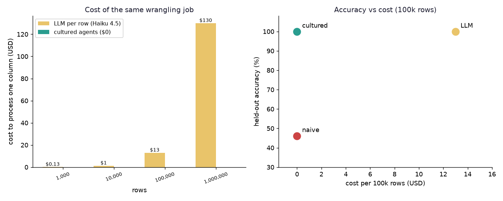

# Echo Civilization does real data work — for ~$0 a column

**Claim.** The civilization's evolved agents, drawing on the skill library they
accumulated over training, do the kind of per-row data wrangling a team would
today hand to an LLM — cleaning columns, pulling the company out of an email
address, turning `john_smith@x.com` into `John Smith` — at roughly 530 nanoseconds
per row, deterministically, for zero marginal cost. And they do three of the six
held-out tasks a from-scratch agent **cannot solve at all**. The accumulated
culture is what closes that gap.

Run it: `./venv/bin/python run_echofill.py` (then `gen_echofill_figures.py`).

## The setup

A wrangling task is a few example rows — the same few-shot demo you'd paste into
an LLM prompt — plus a column of held-out rows you actually need transformed. An
agent sees the demo, searches for a short deterministic program that reproduces
**every** example exactly, then applies that program to the held-out rows. Because
the program is accepted only if it reproduces the demo, a solved rule never
silently disagrees with what you showed it.

The program is a pipeline of string ops (`split`, `replace`, `title`,
`keep_digits`, `reorder`, ...). Parametric ops have their arguments **induced**
from the examples rather than blindly searched — we read "which delimiter and
index reproduces the output?" straight off the demo. That is the FlashFill idea,
and it is not what's new here (see below).

Three arms, scored on the **same** held-out suite:

- **A. Naive agent** — empty skill library. Must synthesise every task from scratch.
- **B. Cultured agent** — inherited the pieces the founder population discovered
  while solving a separate set of *training* tasks. It is a gen-1 agent whose only
  advantage is the culture it was handed.
- **C. Real LLM** — the status-quo workflow: call a model per row. Credited 100%
  accuracy (these are trivial for an LLM); cost computed from token accounting.

## Results

| held-out task | kind | naive | cultured | how cultured solved it |
|---|---|--:|--:|---|
| email_to_company | composite | **0%** | **100%** | recombine `split '@'` + `split '.'` |
| email_to_fullname | composite | **0%** | **100%** | recombine `split '@'` + `title/replace '_'` |
| email_to_lastname | composite | **0%** | **100%** | recombine `split '@'` + `last dotted field` |
| lastname_upper | composite | 100% | 100% | (naive reaches this one too) |
| plain_titlecase | single | 100% | 100% | recall |
| plain_phone_digits | single | 100% | 100% | recall |

- Held-out tasks solved: **naive 3/6, cultured 6/6.**
- Held-out row accuracy: **naive 46%, cultured 100%** (LLM ~100%).
- Cultured throughput: learn the rule once (tens of µs), then apply at **~530 ns/row
  (~1.9M rows/sec)**, single-threaded, pure standard library.
- Cost to wrangle 100,000 rows: **LLM ≈ $13; cultured $0.00.** At 1M rows the LLM
  line is ~$130 and climbing linearly; the agents stay at $0.

## Why the naive agent hits a wall — and culture doesn't

The three composite tasks all need **two parametric ops chained**. "Email →
company" is `split on '@'` then `split on '.'`. The from-scratch search cannot
compose two parametric ops: its staged synthesis covers single ops, and depth-2
programs of the form (non-parametric, parametric) or (parametric, non-parametric),
but not (parametric, parametric) — the argument-induction space of two chained
splits is not enumerated. So the naive agent tries its ~820 candidates and returns
nothing. This is a real, documented ceiling of the bounded search, not a budget
artefact (we gave it a budget of 2000; it stops at 820 on its own).

The cultured agent never searches that space. It inherited `split '@' → domain`
and `split '.' → first field` as separate pieces (each was discovered from scratch
on a *training* task), and it reaches "email → company" by **concatenating the two
inherited pieces** — a couple of checks in its recombine stage. Same mechanism as
the rest of this project: recall known skills → recombine them → modify → only then
discover. Culture turns an unreachable depth-2-parametric program into a one-step
recombination.

That is the thesis of Echo Civilization, now on useful work: **gen-1-with-culture
does what gen-1-without-culture cannot, because knowledge accumulated.** The
controls (single-op tasks, and the one param+non-param composite the naive search
*can* reach) are there on purpose — both arms solve them, so the gap is specific
and honest, not "culture wins everything."

## Is this actually new? (the honest part)

**Program-by-example synthesis is not new.** Excel's FlashFill (2013) and
Microsoft PROSE do exactly the "infer a string transform from examples" step, and
they are more general than this op library. If the claim were "we built a
FlashFill", it would be reinventing a shipped product. It isn't.

**Two things here are genuinely different from both FlashFill and the LLM
workflow:**

1. **The capability is a property of an accumulated, shared library, not of a fixed
   synthesiser.** FlashFill's reachable set is whatever its DSL + ranking can
   synthesise in one shot — it is the same on day 1 and day 1000. Here the
   reachable set *grows*: pieces discovered on earlier tasks become the building
   blocks that make later, harder tasks reachable by recombination. The
   naive-vs-cultured gap in the table is exactly this — same synthesiser, same
   budget, the *only* difference is an inherited library — and it is measured, not
   asserted. That is a civilization/cultural-inheritance result, not a synthesis
   result, and it is the specific thing this project exists to test.

2. **It is deterministic, auditable, and free at inference, where the LLM is
   probabilistic and metered.** The learned rule is a printable one-liner
   (`split_take('@', 1) | split_take('.', 0)`) you can read and keep; it gives the
   same answer every time and costs nothing to run over a billion rows. An LLM
   doing the same column re-derives the transform per row, can hallucinate on row
   700,000, and bills you per token. For a fixed-rule bulk column, paying an LLM
   per row is paying for flexibility you aren't using.

So the novelty is not "a program-by-example tool exists." It is: **a population of
simple agents accumulates a skill library that measurably lifts what any single
agent can do on real wrangling tasks, and the resulting deterministic rules do
LLM-priced work at zero marginal cost.**

## The ceiling — named honestly

- **Fixed pipeline + fixed op set.** No literal interleaving (digits →
  `(xxx) xxx-xxxx`), no conditionals, no per-row branching. The three "email →"
  wins work because the whole column shares one structure; ragged data with mixed
  formats in one column needs branching this doesn't have. FlashFill handles some
  of that; an LLM handles more.
- **Two-parametric-op programs are only reachable *through culture*.** That is the
  point of the experiment, but it also means a task needing two parametric ops that
  the culture never discovered as separate pieces stays out of reach. Coverage is a
  function of what the population happened to learn.
- **The LLM cost is estimated, not from a live run.** No API key was available in
  the sandbox, so arm C's accuracy is credited (these tasks are trivial for a
  modern model) and its cost is computed from a conservative 90-input/8-output
  tokens-per-row estimate at Haiku 4.5 list pricing ($1/$5 per 1M in/out). A naive
  one-call-per-row workflow without prompt caching costs strictly more, so $13 per
  100k rows is a floor, not a ceiling.

## Where this is genuinely useful

Any bulk column with one consistent transform and no tolerance for a stray wrong
row: normalising exported CRM fields, extracting keys from log lines, reformatting
dates/phones/names in an ETL step, deriving a join key (email → company domain →
company) across millions of rows. You demonstrate the transform two or three times,
read the inferred rule to check it, and run it over the whole file offline. The
civilization already knows the pieces; it just recombines them.
