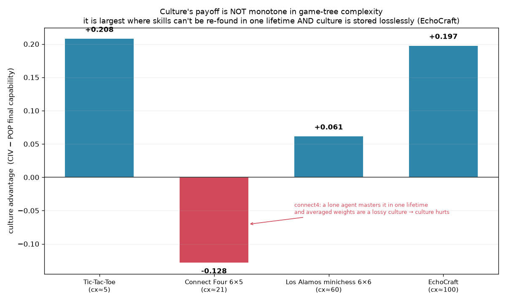
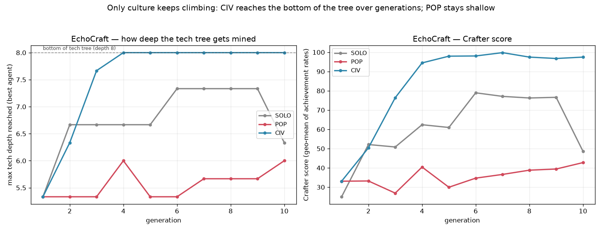
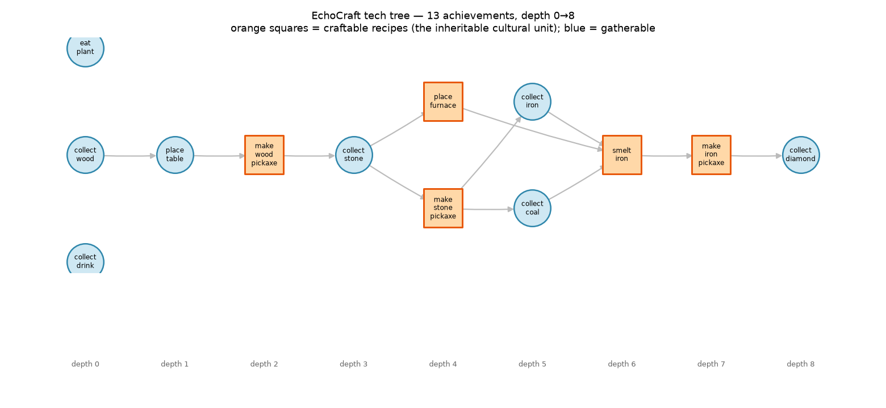
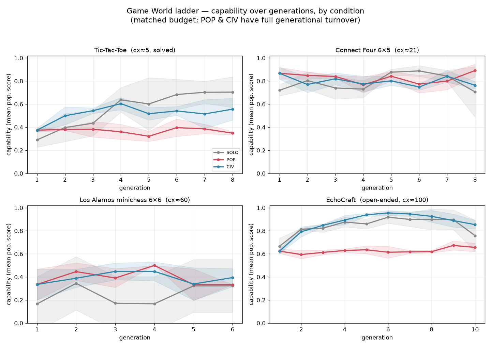

# Game World — findings (Experiment L)

Run it yourself: `./venv/bin/python run_games.py --seeds 0 1 2` → `results/games.json`,
then `./venv/bin/python gen_games_figures.py` → the four figures below. Pure numpy +
stdlib, no pretrained models — the same rules as the rest of Echo Civilization.

## What happened, in one paragraph

In EchoCraft — a Crafter/Minecraft-style survival world with a 13-step tech tree — a
civilization that inherits discovered recipes climbs from tech-depth 5.3 to **8.0, the
bottom of the tree**, over ten generations, lifting its Crafter score from 33 to **99**.
A matched population that can't share stays flat at depth ~5.5 and score ~38, generation
after generation. Generation N finishes a tech tree generation 1 and the isolated
population never finish, because the recipes accumulated culturally. That's the whole
project's thesis, reproduced in a game graded by its own achievement list — not by us.

But the ladder up to EchoCraft is where it gets honest.

## The setup

Four externally-defined games, ordered by game-tree complexity (log₁₀, from the RL
literature), each run under three matched-budget conditions:

- **SOLO** — one agent, learning alone for its whole life.
- **POP** — a population, each agent learning alone, no sharing, full generational turnover.
- **CIV** — a population that contributes discoveries to a shared culture and inherits it,
  with full generational turnover so knowledge either transmits or dies with its agent.

| Rung | Game | cx | Learner | Culture representation |
|---|---|---|---|---|
| 1 | Tic-Tac-Toe (solved) | ≈5 | tabular MC-control self-play | shared state→move answer-book |
| 2 | Connect Four 6×5, win-4 | ≈21 | linear TD on afterstate features | averaged weight vector |
| 3 | Los Alamos minichess 6×6 | ≈60 | linear eval + depth-2 α-β, TD-leaf vs a material engine | averaged eval weights |
| 4 | EchoCraft (open-ended) | ≈100 | macro-options + tabular Q over abstract inventory state | discovered recipe set |

Los Alamos minichess (6×6, no bishops) is the historical first program to play a full
chess-like game, 1956 — the "chess" rung you can run without a GPU.

## The headline result — and it's not a clean line

Final culture advantage (CIV − POP capability): **+0.208, −0.128, +0.061, +0.197**.

Connect Four — strictly more complex than Tic-Tac-Toe — is where culture *hurts*. If the
story were "culture helps more as games get harder," this bar would be positive and small.
It's negative. That's the interesting part, and chasing it down gives a sharper claim than
the monotone one would have.

Two variables, not raw complexity, decide whether culture pays:

1. **Re-discoverability within one lifetime.** Connect Four is learnable in a single
   lifetime — a lone agent hits ~0.89 vs a heuristic inside one generation's 90 episodes.
   So mortality never bites POP, and there's nothing for culture to rescue. Tic-Tac-Toe
   under a tight Monte-Carlo budget is *not* fully re-mastered each life, so pooling the
   answer-book across the population helps. EchoCraft's deep tree is nowhere near
   re-discoverable in a lifetime — that's the whole point of it.

2. **Lossless vs lossy culture.** Connect Four and minichess transmit culture by
   *averaging continuous weight vectors*. Averaging two competent-but-different linear
   policies gives a worse one, so CIV trails the best solo learner. EchoCraft transmits a
   *discrete recipe set* — a union of discoveries only ever adds. Lossy culture: more is
   worse. Lossless culture: more compounds.

EchoCraft is the single rung where both align, and it's where culture wins big.

## The money result: EchoCraft

EchoCraft's 13 achievements form a dependency tree of depth 0→8:

The orange squares are craftable recipes — the inheritable cultural unit. A recipe is hard
to invent (tinkering discovers it with low probability, and only after you've gathered its
ingredients, which needs every shallower recipe already known) but trivial to copy once
someone has it. So the serial chain "discover table → discover wood-pickaxe → mine stone →
discover furnace → …" is what a lone agent has to walk end-to-end inside one short life.

Across ten generations:

| | max tech depth | Crafter score | achievements (of 13) |
|---|---|---|---|
| CIV | 5.3 → **8.0** (bottom, then holds) | 33 → **99** | 9.2 → **12.9** |
| SOLO | 5.3 → ~7.3 (never reaches 8) | 25 → ~77 | → ~11.7 |
| POP | ~5.5, flat | ~38, flat | ~9, flat |

The no-sharing population never gets past the shallow end — every generation restarts the
serial discovery from scratch and runs out of budget in the same place. A single lifelong
SOLO agent does better (it accumulates within one long life) but never reaches the bottom,
and collapses when its one run draws an unlucky map. Only CIV, inheriting the recipe set,
reliably mines the whole tree. That is the project's thesis in an open-ended world:
**generation N reaches a tech depth generation 1 provably could not, because knowledge
accumulated culturally.**

## Per-rung learning curves

## What this adds

The designed worlds elsewhere in the project show *that* culture accumulates. Game World
shows *when*. Culture isn't a free lunch that scales with difficulty — it's the mechanism
that wins precisely when a task is too deep to re-solve in one lifetime **and** its
knowledge can be passed on without loss. A board game with lifetime-learnable tactics and
lossy weight-averaging doesn't need it and can be hurt by it. An open-ended crafting world
with a deep, discrete tech tree can only be finished by it.

## Honest limits

- EchoCraft is a small grid (9×9, ~90-step lives, macro-options over an abstract 9-bit
  inventory state), not real Minecraft. The tech tree and discrete-recipe culture are the
  point; the physics are minimal.
- The minichess rung is a genuinely noisy middle: eval by material-margin over few games
  swings gen-to-gen, and its small positive advantage (+0.061) shouldn't be over-read. The
  cross-rung *pattern* is the claim, not that one number.
- Connect Four's negative result is a property of weight-averaging as a culture, not proof
  that culture can't help competitive board games — a lossless representation (e.g. keeping
  the best learner's weights, or a shared opening book) would likely change its sign. Left
  as-is because the contrast with EchoCraft's recipe-set culture is exactly the lesson.
