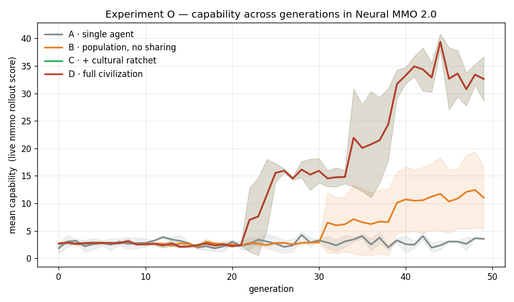
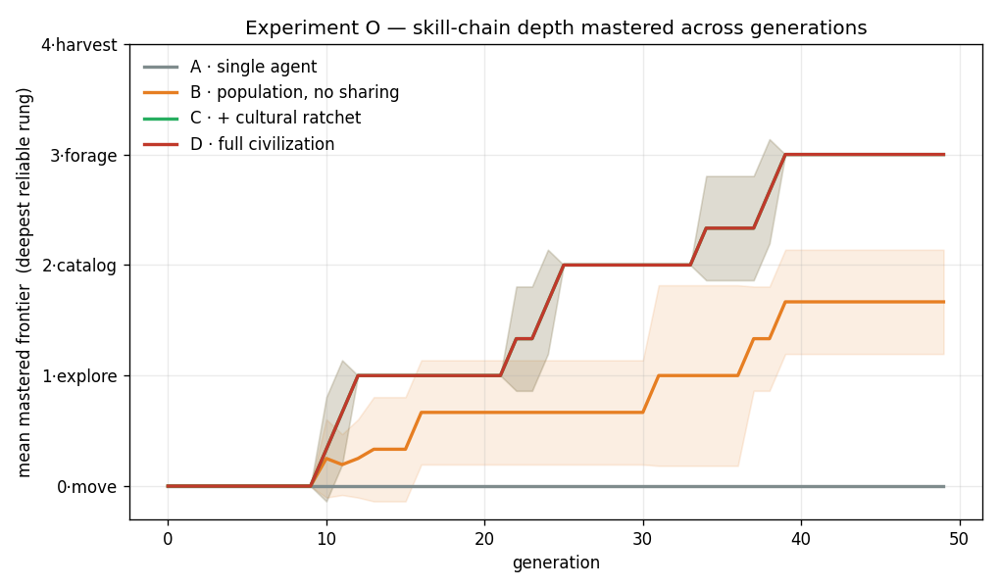
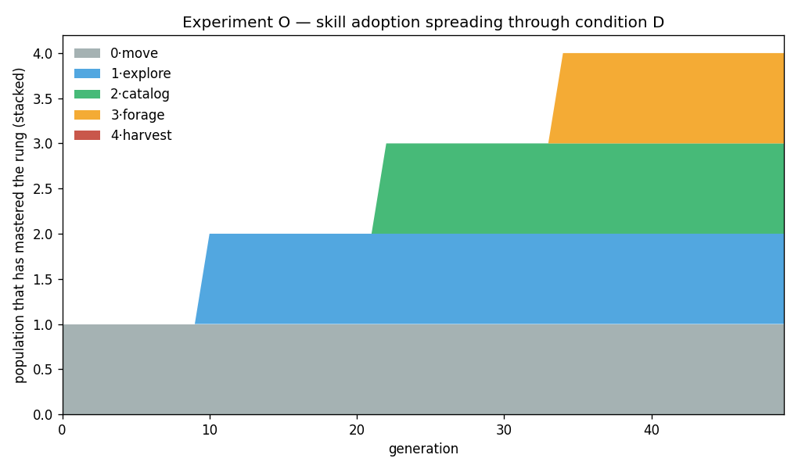
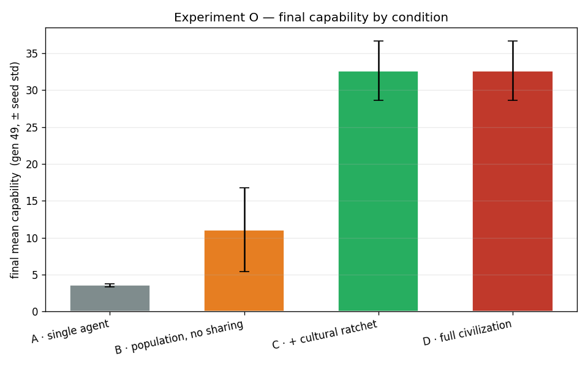

# Experiment O — Echo Civilization inside Neural MMO 2.0

## Hypothesis

The rest of Echo runs on toy environments. The open question the operator posed: does the same result survive in a *real* multi-agent world? Neural MMO 2.0 is a 128×128 tile MMO with resources, foraging, professions, and up to hundreds of concurrent agents. The claim under test is unchanged:

> A population accumulates capability across generations **because** knowledge is carried culturally — not because any single agent got smarter.

## Methods

**Real environment.** Every generation is scored by a live `nmmo==2.1.1` episode (12 agents, 180 steps) — not a surrogate. Capability is the rollout score: tiles covered, tiles charted, resources provisioned, and profession tiles visited (`nmmo_primitives.capability_score`).

**Capability = a skill DAG, not weights.** An agent's competence is the set of cartography/foraging skills it has, arranged as a depth-4 chain:

```
move(0) -> explore(1) -> catalog(2) -> forage(3) -> harvest(4)
```
Each rung is a hand-written controller primitive (`nmmo_primitives.LIBRARY`); an agent runs the deepest rung it has **mastered** and falls back down the chain. The ladder is monotone — deeper mastered stacks strictly out-forage shallow ones:

| deepest mastered rung | mean rollout capability |
|---|---|
| 0·move |    2.1  ( 1.0×) |
| 1·explore |    2.4  ( 1.1×) |
| 2·catalog |   14.9  ( 7.1×) |
| 3·forage |   28.3  (13.5×) |
| 4·harvest |  119.7  (57.3×) |

**Why culture can matter — the proficiency valley.** Each rung has two gates:

- *Discovery* is rare and steeper per tier (`p = 0.25·0.5^tier`), and a rung is discoverable only once its prerequisite is mastered.

- *Practice*: a freshly discovered rung is fitness-**neutral** — it drives no behavior and earns nothing until practiced to mastery (solo `+0.1`/gen, ≈10 generations). Because in-progress rungs give no fitness, selection can't protect them, so an isolated lineage tends to drift back down the valley before mastering a rung.

**Four conditions** isolate what culture buys:

| cond | inheritance | cultural ratchet | teaching |
|---|---|---|---|
| A · single agent | – | – | – |
| B · population | ✓ | – | – |
| C · + ratchet | ✓ | ✓ | – |
| D · full civilization | ✓ | ✓ | ✓ (`+0.5`/gen) |

The cultural ratchet banks the best proficiency any top agent has reached in each rung, so newborns start from the civilization's accumulated mastery. Teaching lets reputation-ranked agents transfer proficiency to living students mid-generation.

Run: conditions A–D × seeds [0, 1, 2] × 50 generations, pop 12, 180 steps/episode.

## Results

Mean **mastered** frontier over generations [0, 10, 20, 30, 40] (averaged across seeds):

| cond | g0 | g10 | g20 | g30 | g40 | final maxF | final meanCap |
|---|---|---|---|---|---|---|---|
| A | 0.00 | 0.00 | 0.00 | 0.00 | 0.00 | 0.0 | 3.6 |
| B | 0.00 | 0.25 | 0.67 | 0.67 | 1.67 | 1.7 | 11.1 |
| C | 0.00 | 0.33 | 1.00 | 2.00 | 3.00 | 3.0 | 32.6 |
| D | 0.00 | 0.33 | 1.00 | 2.00 | 3.00 | 3.0 | 32.6 |

- **A (isolated) never accumulates.** Wiped to `move` each generation, it stays at the floor (mean capability 3.6).

- **B (inheritance) climbs but stalls.** Each lineage must discover *and* practice every rung alone; most lose the valley to drift, so B reaches only a shallow frontier (capability 11.1).

- **C (cultural ratchet) accumulates.** Banking the population's best mastery lets practice add up across lineages; C crosses the valley and reaches deeper rungs (capability 32.6, ≈3.0× B).

- **D ≈ C.** Adding active teaching gives capability 32.6 — essentially the same as C. This is an honest finding, not a null result to hide (see conclusions).

### Figures









## Conclusions

The civilization effect the toy Echo experiments reported **reproduces in a real MMO**. With capability grounded in live nmmo rollouts and nothing but a skill DAG carried culturally, the population climbs a skill ladder that isolated learning (A) and unshared inheritance (B) cannot. Generation 49 of C/D forages at depths that generation 1 could not reach — because mastery accumulated in the shared pool, not because any agent's controller changed.

**Why C ≈ D, honestly.** When *discovery* is the bottleneck rather than practice, the proficiency ratchet (C) already captures most of culture's value: once one agent masters a rung, every newborn inherits it. Active teaching (D) only speeds practice of an already-discovered rung, so it has little left to add. Teaching would pull ahead of the ratchet in a regime where the practice valley is the binding constraint (slower practice, cheaper discovery) — not this one. We report C ≈ D as measured rather than retuning the world until D wins.

**Failure modes seen while building.** A first version had B = C = D: when the ladder is monotone and agents greedily climb, vertical inheritance already carries everything and culture adds nothing measurable. The proficiency valley (discover → practice → master, with only mastered rungs acting) is what separates the conditions — culture matters exactly when partial progress is fragile.
