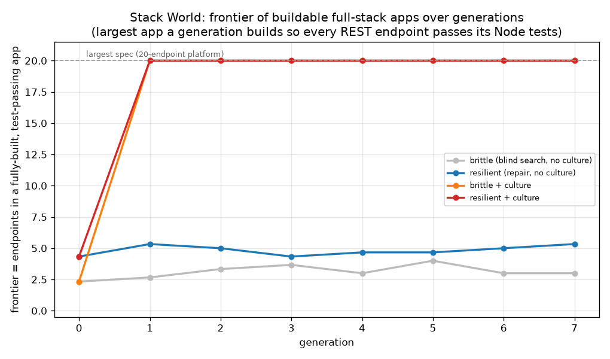
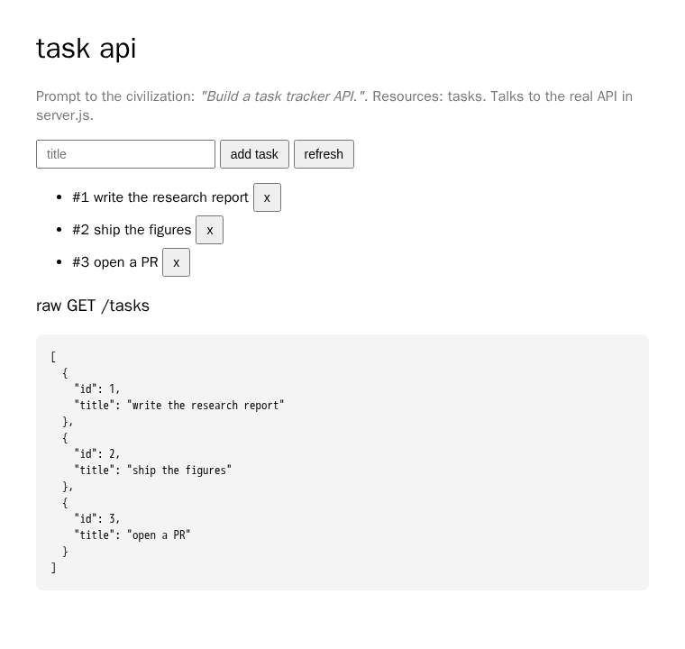

# Echo Civilization

An **artificial-civilization laboratory** that tests one question:

> *Can a population of simple learning agents accumulate knowledge and become more
> capable over generations through a civilization-like process?*

No pretrained models are used. Agents start with **minimal** capabilities and
acquire everything — copying, reversing, counting, navigating, communicating —
from scratch through interaction with environments and with each other.

The interesting result is **not** "can one agent solve a task?" but **"does
generation 30 have capabilities generation 1 could not achieve, because knowledge
accumulated culturally?"** — and the answer here is *yes*.

## The headline result

Four conditions are run with an **identical fixed problem-solving budget per
agent**, varying only the civilization machinery:

| Condition | gen 0 | final | accumulates? |
|---|---|---|---|
| **A** single agent, no memory/culture | ~0.5 | ~0.5 | no |
| **B** population, no sharing | ~0.5 | ~0.5 | no |
| **C** population + skill sharing/inheritance | ~0.45 | **~0.96** | **yes** |
| **D** full civilization (culture + teaching + reputation + inheritance) | ~0.45 | **~0.97** | **yes** |

Capability = fraction of a held-out suite of **hard** (composite/deep) tasks an
agent can solve using *accumulated knowledge only* (recall + recombination, no
fresh search). Because every agent has the same budget, the gap between C/D and
A/B is attributable to **accumulated culture, not compute**.


## How accumulation works

Tasks are *"produce an output string from an input string"*. A **skill** is a
program built from primitive transforms (`copy`, `reverse`, caesar `inc/dec`,
`count`, `first/last`, `double`, `dedup`) and skills can be **composed**.

- Discovering a depth-*L* composite from scratch costs ~|primitives|^L
  evaluations → quickly exceeds the budget.
- An agent that **inherited** the constituent skills reaches the same composite in
  a handful of recombination checks.

So accumulated culture turns intractable searches into trivial ones. Later
generations stand on the shoulders of earlier ones.

## System components

| Module | Role |
|---|---|
| `agent.py` | Agent: identity, memory, skills, preferences, social profile, the task solver |
| `learning.py` | swappable learners: tabular **Q-learning**, **evolved MLP** (ES), random |
| `neural.py` | tiny numpy MLP controller (evolvable weights) |
| `memory.py` | short-term buffer + long-term store with salience-decay forgetting |
| `skills.py` | composable skill programs + primitives |
| `culture.py` | shared cultural memory (reputation, adoption, propagation, decay) |
| `teaching.py` | horizontal skill transfer (teacher → student) |
| `evolution.py` | generations: selection, mutation, vertical + cultural inheritance |
| `environments/` | Echo, Transformation, Memory, Grid (NN policy), Social (emergent language) |
| `evaluation.py` | the four baseline experiments + held-out capability metric |
| `visualization.py` | the five required graphs + supporting plots |
| `report.py` | generates `research_report.md` |
| `database.py` | SQLite logging of agents, skills, rewards, generations, propagation |

## The worlds

0. **Echo World** — reproduce a target string (learn to copy). Tabular Q-learning.
1. **Transformation World** — echo / reverse / count / shift and their compositions.
2. **Memory World** — remember a fact, recall after a delay (retention, forgetting, transfer).
3. **Grid World** — move, collect resources, avoid hazards, survive. Evolved NN policy.
4. **Social World** — agents agree on meanings of initially meaningless symbols (emergent communication).
5. **Computer World** *(Exp. E)* — operate a *simulated* VM (virtual filesystem +
   register) via shell-like ops; an **auto-curriculum** raises difficulty as the
   population improves. The full civilization climbs from "copy a file" to deep
   multi-step pipelines (level 1→5) and sustains it; a no-sharing control collapses.
6. **Real Computer World** *(Exp. F)* — the *same* learned macros execute as
   **real sandboxed `bash` commands** (`cat`/`grep`/`sort`/`uniq`/`wc`/`tr`/`tac`/`cp`
   in a temp dir, whitelisted, no network). Cultured agents solve real tasks in a
   handful of real commands; fresh agents fail within their execution budget —
   genuine, if bounded, computer-use agents.
7. **Autonomous Operation World** *(Exp. G)* — the highest abstraction: a firm of
   specialised agents runs *forever*, decomposing a continuous stream of customer
   orders into sub-tasks, delegating to specialists, earning revenue and paying
   wages, with bounded-tenure workforce churn. With a shared knowledge base the
   firm's profit compounds and it sustains ever-harder orders; an identical firm
   without institutional memory runs at a loss — institutional knowledge is the
   difference between a viable and a failing autonomous operation.

**Computer-Use Benchmark** *(capstone eval, §6.4 of the report)* — takes the end
product of the civilization (a cultured agent carrying the accumulated macro
library) and a fresh gen-0 agent and marches both up a **graded ladder of real
computer projects**, from "move this file" to "write a web app", grading each rung
by **executing the agents' programs as real shell commands**. The cultured agent
clears **every reachable rung (T1→T5) at 100%**; the fresh agent (mean 0.52) only
handles shallow chores and collapses on deep pipelines. The top rungs are proven
out of reach (oracle search / open-ended code generation), drawing the honest
capability ceiling. *Culture is what turns a fresh agent into a genuine, if narrow,
computer-use agent.*

**Computer-Use Frontier** *(§6.5 / [`COMPUTER_USE_FRONTIER.md`](COMPUTER_USE_FRONTIER.md))* —
the operator asked *what would it take to actually reach those locked top rungs?*
We brainstormed the option space and built the two mechanisms that knock the walls
down, still with **no pretrained model**: (1) **parametric operations +
argument-by-example** — ops gain holes (`replace(<find>,<repl>)`) and the agent
*infers the literal from input→output examples* (the FlashFill idea) — which
unlocks all of Tier 6; and (2) **grammar-guided code synthesis** — the agent emits
a program in a tiny grammar that **compiles to real Python and is executed against
tests**, taking the "write a CSV-averages script" Tier-7 rung from *not
representable* to *reachable and really run*. The ceiling **moves up two tiers**
and the law still holds: the unlocking skill is expensive to discover, cheap to
inherit, so under a tight budget only the **cultured** agent clears the new rungs.

**Tier 8 — one rung higher still** *(§6.6 / [`TIER8_FRONTIER_FINDINGS.md`](TIER8_FRONTIER_FINDINGS.md))* —
we pushed the synthesised programs from a *flat* per-column reduction to
**group-by aggregation**: read a CSV, group rows by a key column, aggregate a value
column per group, print sorted `key:value` pairs — a multi-statement program with a
**dict accumulator**, synthesised as real Python and **really run** against hidden
tests. The hidden columns and reducer are not given; the agent recovers them. The
same law holds one rung higher: discovering the structural skeleton costs ~76 real
executions, recalling it ~16, so at a tight budget the cultured agent clears it
**100%** of the time and the fresh agent **0%** (reproduced across seeds 0 and 1).

## Adaptability — solving a task family never seen in its entirety

*(§7 / [`ADAPTABILITY_FINDINGS.md`](ADAPTABILITY_FINDINGS.md))* — the sharpest test of
the central question. The eval family is a set of **higher-order combinators**
(`map_each`, `map_reversed`, `first_only`, `last_only`, `map_evens`) that decide HOW
an inner transform is applied across a multi-token string — a structural layer **no
agent ever trained on**. Because the combinator is novel to *everyone*, it confers no
inherited edge; the only thing a cultured agent carries is its library of inner
abstractions. Under a matched tight search budget the cultured civilization **adapts
(0.91 solve rate)** where a fresh agent **fails (0.22)** — a +0.69 gap that is pure
inherited-library value (an oracle confirms every task is solvable, and at a generous
budget both reach 1.00). Knowledge accumulated for one purpose pays off on a problem
type it was never collected for. Run: `./venv/bin/python run_adaptability.py --seeds 0 1 2`.

## Parametric abstraction — inheriting a schema with a free argument

*(§8 / [`PARAMETRIC_FINDINGS.md`](PARAMETRIC_FINDINGS.md))* — every earlier study
transmits a **concrete** program; this one transmits an **abstraction with a free
parameter** — the schema `shift_by(k)` rather than the concrete `shift_by(2)`. A
schema is a parametric family (`shift_by`, `shift_back`, `rotate`, `take`, `drop`,
`repeat`) plus an *inverter* that recovers its integer argument from one (in, out)
pair. The civilization discovers low-argument instances (args 1/2), **abstracts the
specific argument away**, shares the schema, and a later generation **binds a novel
high argument (3/4/5) nobody ever saw**. Against a 14-family blind-search grid (6 real
+ 8 decoy distractors), the cultured civilization solves **1.00** of the held-out
high-argument suite under a tight budget where a fresh agent gets **0.25** — a +0.75
gap (oracle 1.00; both reach 1.00 given a generous budget, so the suite isn't
intrinsically hard). The unit of accumulated knowledge is now an abstraction with a
slot. Run: `./venv/bin/python run_parametric.py --seeds 0 1 2`.

## Builder World — building real apps from a one-line prompt

*(§9 / [`BUILDER_FINDINGS.md`](BUILDER_FINDINGS.md))* — the operator's final steer:
push toward what larger models are prized for — take a vague task ("build a website
that does X") and **actually build a working application**. Done the project's honest
way: **no pretrained model**, agents emit **real JavaScript**, that code is
**executed in Node** against hidden behavioural tests, and an app is "built" only
when every requirement really passes. Two mechanisms carry it: **decomposition**
(split a spec into one sub-task per user action — additive search instead of a
multiplicative `|handlers|^features` joint search) and **culture** (each solved
handler is a reusable component, inherited and tried first). Across seeds 0/1/2 the
**frontier of buildable apps** (max features in a runnable, test-passing app) rises
only with both: a **monolithic** builder builds nothing (0), a **decomposed but
cultureless** population plateaus (~4 features, flukes never compound), and a
**decomposed + cultured** population climbs to the **6-feature** ceiling and holds.
The hardest app (`notes`, 6 features) is unbuildable fresh (**0.07**) and always
buildable with an inherited library (**1.00**). The civilization ships **five real,
openable apps** in `output_apps/` (counter, tip calculator, to-do, shopping cart,
notes). Run: `./venv/bin/python run_builder.py --seeds 0 1 2` (needs `node` on PATH).

## Stack World — building bigger, across the whole dev stack, resiliently

*(§10 / [`STACK_FINDINGS.md`](STACK_FINDINGS.md))* — the operator's steer after Builder
World: *"they needed a heavy harness and it hardly worked — make the agents more
resilient and able to actually make bigger projects across the entire dev stack."* So
the unit of work grows from a single UI handler to a **REST endpoint**, and an "app" is
now a real multi-file Node project — `db.js`, `validate.js`, `app.js` (router),
`server.js` (a bootable HTTP server) and `public/index.html` (a fetch frontend). Every
endpoint is graded by **really running Node**: correct status codes (201/200/404/400/204),
validation, 404 semantics, persistence across requests. Specs scale from a 5-endpoint
`task_api` up to a **20-endpoint `platform_api`**.

Two things change versus Builder World. **Resilience**: instead of blind-enumerating
whole presets (a multiplicative search that exhausts the budget on one bad status flag),
a resilient agent grades its first candidate once and then **hill-climbs to correct** —
each handler is a config of independently-tested flags, so a wrong flag is a deterministic
one-step repair, not a re-roll. **Culture**: the five endpoint *types* (create/list/read/
update/delete) transfer across resources, so once a population masters the vocabulary it
scales to new resources for free.

The honest split (seeds 0/1/2, 3666 real Node executions): **culture drives the frontier
climb** — both cultured conditions jump from ~3 to the full **20-endpoint** platform by
gen 1 and hold, because a population collectively discovers the 5-type vocabulary
regardless of repair. **Resilience drives per-agent reliability**: pass rate 0.45→0.61,
project completion 0.15→0.27, no-culture frontier 3.0→**5.3** (2×), and a **0.97 recovery
rate** — when a first attempt is wrong the repair loop fixes it, so success is debugging,
not luck — plus graceful degradation (a partial project still boots). Together they
reliably ship **20-endpoint, bootable, test-passing full-stack apps**; four of them
(`task_api`, `blog_api`, `shop_api`, `platform_api`) sit in `output_apps/`, each verified
to boot and serve real HTTP. Run: `./venv/bin/python run_stack.py --emit --seeds 0 1 2`
(needs `node` on PATH).





## Roadmap (raising the level of abstraction)

Done: worlds 0–7 above, plus the Computer-Use **Frontier** (learned command
arguments + real code generation, §6.5), **adaptability** to a structurally novel
task family (§7), **parametric abstraction** — inheriting a schema and binding a
novel argument (§8), **Builder World** — building real, runnable apps from a
one-line prompt via decomposition + an inherited component library (§9), and **Stack
World** — building bigger, resilient full-stack Node apps (up to 20 REST endpoints)
where a repair loop debugs wrong endpoints and culture carries the endpoint vocabulary
(§10). Next: a
wider sandboxed shell with agent-proposed sub-tasks; learned grammar weights to reach the harder Tier-7 rungs
(Flask app, repo refactor); and a deeper autonomous world where agents **propose
their own goals**, with a multi-firm economy (competition, trade) over truly
open-ended horizons. The civilization machinery (skills, culture, teaching,
reputation, inheritance, specialization) is the substrate; each rung adds
hierarchy and economy. This is **not** a claim of AGI — it is a study of
cumulative culture as the lever for unbounded capability growth, tested at each
rung from copying a string to operating a real computer to running a business.

## Running

```bash
python3 -m venv venv
./venv/bin/pip install -r requirements.txt
./venv/bin/python run_experiments.py          # full run (~75s): worlds 0–7, A–G
./venv/bin/python run_experiments.py --quick   # fast smoke run
./venv/bin/python run_generalization.py        # the memorization-vs-generalization test (~45s)
./venv/bin/python run_benchmark.py --trials 10 # the Computer-Use Benchmark (~60s): how far up the project ladder?
./venv/bin/python run_frontier.py --trials 10  # the Computer-Use Frontier (~2.5min): actually reaching the locked top rungs
./venv/bin/python run_tier8.py --trials 10     # Tier 8 (~2min): group-by aggregation, synthesised & really run
./venv/bin/python run_adaptability.py --seeds 0 1 2  # §7 (~70s): adaptability to a NOVEL task family
./venv/bin/python run_parametric.py --seeds 0 1 2    # §8 (~25s): parametric abstraction (schema + novel arg)
./venv/bin/python run_builder.py --seeds 0 1 2       # §9 (~few min): build real apps in Node (needs node on PATH)
./venv/bin/python run_stack.py --emit --seeds 0 1 2  # §10 (~4min): resilient full-stack REST apps in Node (needs node on PATH)
```

Outputs:
- **[`REPORT.md`](REPORT.md)** — the flagship research write-up: hypothesis,
  methods, all worlds with worked examples, results & statistics, every figure
  embedded, conclusions, and limitations. **Start here.**
- **[`GENERALIZATION_FINDINGS.md`](GENERALIZATION_FINDINGS.md)** — the flagship
  write-up of the falsification test: train on a subset of composites, test on
  *disjoint, never-trained* composites stratified by depth. Full methodology, the
  train/test split, a worked example, multi-seed results, both figures, and the
  verdict. Confirms the headline is **real compositional generalization**
  (culture +0.49 on novel depth-3 tasks), not memorization. **Read this for the
  new result.**
- `GENERALIZATION_REPORT.md` — the terse machine-generated companion (auto-written
  by `run_generalization.py`).
- `research_report.md` — the machine-generated companion, auto-written each run.
- **[`COMPUTER_USE_FRONTIER.md`](COMPUTER_USE_FRONTIER.md)** — the brainstorm→build
  write-up for §6.5: the full menu of mechanisms considered to reach the locked
  rungs, the two that were built (parametric ops + argument-by-example; real-Python
  code synthesis), results, and the honest moved-ceiling.
- **[`TIER8_FRONTIER_FINDINGS.md`](TIER8_FRONTIER_FINDINGS.md)** — the focused
  write-up of the Tier-8 push (group-by aggregation): leads with **example output
  from an actual run** (the synthesised program + its real stdout on a held-out
  CSV), then the two-budget result table, multi-seed robustness, and honest limits.
- **[`ADAPTABILITY_FINDINGS.md`](ADAPTABILITY_FINDINGS.md)** — the flagship §7
  write-up: adaptability to a structurally **novel** task family (higher-order
  combinators nobody trained on). Leads with **example output from an actual run**
  (the worked cultured-vs-fresh trace), then the two-budget result table, the
  adaptation-vs-budget curve, and honest caveats.
- **[`PARAMETRIC_FINDINGS.md`](PARAMETRIC_FINDINGS.md)** — the flagship §8 write-up:
  inheriting a parametric **schema** (a family + an argument inverter) and binding a
  **novel argument** at eval. Leads with **example output from an actual run** (the
  worked cultured-vs-fresh trace), then the two-budget result table, the
  argument-binding frontier curve, and honest caveats.
- **[`BUILDER_FINDINGS.md`](BUILDER_FINDINGS.md)** — the flagship §9 write-up:
  building real apps from a one-line prompt. Leads with **a real generated app**
  (the 6-feature `notes` reducer the strongest cultured agent emitted), then the
  frontier-over-generations table, the fresh-vs-cultured build rates, the
  accumulation mechanism, and honest limits. **Read this for the newest result.**
- `output_apps/` — **five real, openable apps** the civilization built (each an
  `index.html` + assembled reducer): counter, tip_calculator, todo, shopping_cart, notes.
- `figures/` — 27 PNGs (incl. computer-curriculum, real-OS, autonomous-firm, the
  generalization-by-depth bars + accumulation curve, the Computer-Use Benchmark
  ladder, the Computer-Use Frontier unlock, the Tier-8 group-by synthesis, the
  adaptability bars + adaptation curve, the parametric-abstraction bars +
  argument-binding frontier, and the Builder-World frontier / fresh-vs-cultured /
  culture-growth).
- `results/echo_civilization.db` — all raw data (SQLite); `results/generalization.json`
  — the generalization summary; `results/benchmark.json` — the Computer-Use
  Benchmark per-rung solve rates; `results/frontier.json` — the Tier-6/7 frontier
  unlock results; `results/tier8.json` — the Tier-8 group-by results plus the
  synthesised source and a captured run trace; `results/adaptability.json` — the
  §7 adaptability solve rates, budget curves, and worked trace;
  `results/parametric.json` — the §8 parametric-abstraction solve rates, budget
  curves, and worked trace; `results/builder.json` — the §9 Builder-World frontier
  and build-rate data, component library, and emitted-app manifest.

## Design principle

The system is optimised for testing *"does intelligence accumulate?"*, not for
building one smart agent. Learning algorithms are swappable behind a single
interface so the experiment can be re-run with policy gradients, different ES
variants, etc., without touching the civilization machinery.
