# Echo Civilization — Research Report

### Does intelligence accumulate? An artificial-civilization laboratory

*A study of whether a population of simple, non-pretrained learning agents can
become more capable over generations through a civilization-like process of
learning, memory, communication, specialization, cooperation, and cultural
inheritance.*

**Run date:** 2026‑06‑16 · **Seed:** 0 · **Runtime:** ~75 s ·
**No pretrained models or external AI APIs are used anywhere.** Every capability
shown below is acquired from scratch through interaction.

---

## Executive summary

We built a complete artificial-civilization laboratory and ran eight experiments
across seven environments — from reproducing a string up to autonomously running a
simulated business. One result dominates:

> **Capability accumulates across generations *only* when agents can share and
> inherit what they discover.** With an identical per-agent problem-solving
> budget, populations *with* a culture climbed from **~45 % to ~97 %** on a
> held-out suite of hard tasks; an isolated agent and a population *without*
> sharing stayed flat near **~50 %**.

The same lever operates at every level of abstraction we tested:

| Experiment | World | With culture | Without culture |
|---|---|---|---|
| A–D | Composable string tasks | **96–97 %** hard-task capability | 50–57 % (flat) |
| E | Simulated computer (auto-curriculum) | climbs to **level 5/5** pipelines | stalls, collapses to 0 |
| F | **Real** sandboxed `bash` | solves **5/5** real tasks | 1/5 |
| G | Autonomous firm (runs "forever") | **+426** cumulative profit | **−92** (runs at a loss) |
| H | **Novel** task family (combinators nobody trained on) | adapts: **0.91** under tight budget | **0.22** (fresh) |
| I | **Parametric** schema, novel argument bound at eval | **1.00** under tight budget | **0.25** (fresh) |
| J | **Builds real apps** from a one-line prompt (run in Node) | frontier **climbs to the 6-feature app**; build rate **1.00** | frontier **flat ~4**; 6-feature app **0.07** |

This is the project's thesis in one line: *the limiting resource for hard problems
is not individual compute but accumulated culture* — and that holds from copying a
five-letter string to operating a real operating system.

---

## Table of contents

1. [Hypothesis](#1-hypothesis)
2. [Methods](#2-methods)
3. [The seven worlds, with worked examples](#3-the-seven-worlds-with-worked-examples)
4. [Results & statistics](#4-results--statistics)
5. [How culture actually spreads (networks)](#5-how-culture-actually-spreads-networks)
6. [Scaling up: computer use & autonomy](#6-scaling-up-computer-use--autonomy)
7. [Adaptability to a novel task family](#7-adaptability-to-a-novel-task-family)
8. [Parametric abstraction (schema with a free argument)](#8-parametric-abstraction--inheriting-a-schema-with-a-free-argument)
9. [Building real applications from a one-line prompt](#9-building-real-applications-from-a-one-line-prompt)
10. [Building bigger: resilient full-stack apps](#10-building-bigger-resilient-full-stack-apps)
11. [Conclusions](#11-conclusions)
12. [Limitations & threats to validity](#12-limitations--threats-to-validity)
13. [Reproducibility & data](#13-reproducibility--data)

---

## 1. Hypothesis

**Central research question.** *Can a population of simple learning agents
accumulate knowledge and become more capable over generations through a
civilization-like process?*

**H1 (main).** A population that shares and inherits discovered skills (a *culture*)
will solve harder tasks over successive generations, while an isolated agent or a
population without sharing will not — **even when every agent is given an
identical, fixed problem-solving budget.**

**Sub-hypotheses (each tied to one world):**

| ID | Claim | World |
|---|---|---|
| H1a | Individuals can learn primitive skills from reward alone | Echo (Q-learning) |
| H1b | Memory retains, decays without reinforcement, and can transfer | Memory |
| H1c | A *different* learning algorithm improves over generations | Grid (evolved NN) |
| H1d | A shared communication protocol can emerge from meaningless symbols | Social |
| H1e | The accumulation effect extends to tool use | Computer / Real OS |
| H1f | It extends to sustained, open-ended autonomous operation | Firm |

---

## 2. Methods

### 2.1 Agents (not language models)

Each agent has the architecture the brief specifies:

- **Identity** — unique id, generation number, parent ids.
- **Internal state** — a *swappable learner*, a library of known **skills**,
  short-term memory (rolling window of recent obs/actions/rewards) and long-term
  memory (episodic store + semantic facts with salience-decay forgetting),
  and behavioural **preferences** (exploration, imitation, risk).
- **Goals** — maximise reward, explore, learn useful behaviours.
- **Social profile** — reputation, relationships, teaching history, contribution
  history.

### 2.2 Learning algorithms are interchangeable

A single `Learner` interface backs three algorithms, so the experiment can swap
the learning rule without touching the civilization machinery:

- **Tabular Q-learning** — the genuine *experience → reward → policy* loop
  (Echo World, character-substitution discovery).
- **Evolved numpy MLP** — an evolutionary strategy (mutation + selection, no
  backprop) (Grid World).
- **Random** — control/ablation.

### 2.3 Skills as composable programs

Tasks in the core experiments are *"produce an output string from an input
string."* A **skill** is a program built from primitive transforms
(`copy`, `reverse`, caesar `inc/dec`, `count`, `first/last`, `double`, `dedup`),
and skills can be **copied, modified, and composed**. Each `Skill` carries the
metadata the brief requires: name, creator, generation, preconditions, examples,
success rate, usage count — plus culture-level reputation and adoption.

An agent solves a task in three stages under a fixed **evaluation budget**:

1. **Recall** a known skill (own or inherited),
2. **Recombine** two known skills,
3. **Discover** from scratch (Q-learning for substitutions; bounded, shuffled
   blind search for structure).

### 2.4 Why culture is decisive (the mechanism)

Blind discovery of a depth-*L* composite costs ≈ |primitives|^L evaluations and
quickly blows the budget. An agent that **inherited** the constituent skills
reaches the same composite in a handful of recombination checks. Culture thus
converts an exponential search into a trivial lookup — *standing on the shoulders
of giants*, made mechanical.

### 2.5 Generations, evolution & the four conditions

Each generation: build a population → agents attempt tasks under the budget →
discovered skills are abstracted and (if enabled) contributed to a shared
**cultural memory** → optional peer **teaching** → fitness measured →
fitness-weighted selection + mutation produce the next generation, which
**inherits** parent and cultural skills. Unused cultural skills lose reputation
and are forgotten.

The four baseline conditions hold world, seed, population, budget, and task count
**fixed** and vary only the civilization machinery:

| Condition | Population | Culture | Inheritance | Teaching | Reputation |
|---|---|---|---|---|---|
| **A** single agent | 1 | ✗ | ✗ | ✗ | ✗ |
| **B** population, no sharing | 24 | ✗ | ✗ | ✗ | ✗ |
| **C** population + skill sharing | 24 | ✓ | ✓ | ✗ | ✗ |
| **D** full civilization | 24 | ✓ | ✓ | ✓ | ✓ |

**Capability metric.** A held-out suite of **hard (composite + deep) tasks**,
solved using *accumulated knowledge only* (recall + recombination, **no** fresh
blind search), averaged per agent — so a larger population gets no unfair
brute-force advantage. Key parameters: 30 generations, population 24, budget 35
evaluations/task, 8 tasks/agent/generation.

---

## 3. The seven worlds, with worked examples

The agents progress up a ladder of abstraction. Below, each world's behaviour is
shown with **real traces captured from the run** (not illustrations).

### Environment 0 — Echo World (learn to copy)

A tabular Q-learner is rewarded for reproducing characters. It discovers the
identity mapping from reward alone and **masters copying at training episode 6**
(100 % character accuracy). This is the foundational `copy` skill that every later
composite is built on.


*Figure 7 — Greedy character-copy accuracy per training episode. The agent goes
from random to perfect copying in ~6 episodes using Q-learning only.*

### Environment 1 — Transformation World (skills combine)

Harder structured tasks (reverse, count, caesar-shift) **and their compositions.**
Actual tasks a culture-seeded agent solved during the run:

| Rule | Demonstration | Query → agent output | Target | ✓ |
|---|---|---|---|---|
| echo | `baccg → baccg` | `cfch` → **`cfch`** | `cfch` | ✓ |
| reverse | `deee → eeed` | `bgeaa` → **`aaegb`** | `aaegb` | ✓ |
| count | `abeh → 4` | `haa` → **`3`** | `3` | ✓ |
| reverse **then** shift | `hfh → aga` | `ech` → **`adf`** | `adf` | ✓ |

The composite `reverse then shift` is solved by recombining the inherited
`reverse` and `inc1` skills — the key behaviour the whole project tests.

### Environment 2 — Memory World (retention, forgetting, transfer)

An agent is told a fact ("the treasure is behind the blue door") and quizzed after
a delay during which interfering experiences decay the memory. Real results:

| Delay (interfering steps) | Recall correct | Retention strength |
|---|---|---|
| 0 | ✓ | 1.00 |
| 5 | ✓ | 0.81 |
| 20 | ✓ (weak) | 0.44 |

A classic **forgetting curve**, and facts can be **transferred** to a naive agent
(verified in the run).


*Figure 8 — Mean recall strength vs. interference delay: memory decays smoothly
without reinforcement.*

### Environment 3 — Grid World (a physical sim, evolved by a neural net)

Agents move on an 8×8 grid with limited vision and finite energy, collecting
resources and avoiding hazards. The policy is a small numpy **neural network
improved by evolution** (no gradients). Best-episode reward rose from **1.6 to
6.1** across generations.


*Figure 9 — Population-mean and best episode reward over generations of an evolved
MLP policy. A second, distinct learning algorithm also improves over generations.*

### Environment 4 — Social World (language emerges)

Agents play a referential signalling game with **initially meaningless symbols**.
No meanings are given; agents must agree on a protocol. The population converged to
**100 % communication accuracy and 100 % protocol consistency.** The emergent
shared lexicon from the run:

| Concept | Symbols agents chose | Consensus symbol |
|---|---|---|
| 0 | all six chose `2` | **2** |
| 1 | four chose `0`, two chose `2` | **0** |
| 2 | all six chose `1` | **1** |

Meaning **emerged**; it was not designed in.


*Figure 10 — Communication accuracy and protocol consistency climbing to 1.0 as a
shared "language" crystallises out of random symbols.*

### Environments 5–7 — Computer, Real OS, and the Firm

These scale the same accumulation principle up to tool use and autonomy; they get
their own section ([§6](#6-scaling-up-computer-use--autonomy)).

---

## 4. Results & statistics

### 4.1 Headline: capability accumulates only with culture


*Figure 1 — Average per-agent capability on held-out hard tasks. **C and D
(sharing) shoot up to ~0.96 within a few generations and plateau; A and B
(no sharing) oscillate around 0.5 forever.** All four conditions use an identical
per-agent budget.*

| Condition | Gen 0 | Final | Δ | Mean training reward | Final culture (skills) |
|---|---|---|---|---|---|
| A single agent | 59 % | 57 % | **−0.02** | 0.767 | 0 |
| B population, no sharing | 44 % | 50 % | **+0.06** | 0.768 | 0 |
| C population + sharing | 44 % | **97 %** | **+0.53** | 0.959 | 16 |
| D full civilization | 49 % | **96 %** | **+0.47** | 0.962 | 15 |

*(Mean training reward computed over all logged reward events: 240 for A, 5,760
each for B/C/D.)*

**Skill accumulation drives it.** Average skills *known per agent* over the run:

| Condition | Gen 0 | Gen 5 | Gen 20 | Gen 29 |
|---|---|---|---|---|
| A / B (no sharing) | 3–5 | ~4 | ~4 | ~4 (flat) |
| C | 3.4 | 13.8 | 15.4 | **15.5** |
| D | 3.9 | 12.4 | 14.9 | **14.5** |

Without sharing, each agent re-discovers a handful of skills per lifetime and the
knowledge dies with it. With sharing, the per-agent library **quadruples** as the
shared culture is inherited — and that is exactly when hard-task capability takes
off.

### 4.2 Behavioural complexity rises only with culture


*Figure 5 — Average composition depth of solved tasks. Sharing conditions
steadily solve deeper (more composed) tasks; non-sharing conditions plateau at
shallow depth.*


*Figure 6 — Size of the shared cultural repository over generations (C and D grow
and stabilise at 15–16 distinct skills; A and B remain empty by construction).*


*Figure 2 — Best-agent fitness per generation across the four conditions.*


*Figure 11 — Solve rate by task difficulty in the full civilization. Deep
(difficulty-3) tasks become reliably solvable only after the requisite skills
accumulate in culture.*

### 4.3 The most reputable skills the civilization invented (condition D)

Pulled from the `skills` table at the final generation:

| Skill | Program | Depth | Adoption | Reputation |
|---|---|---|---|---|
| count | `count` | 1 | 116 | 24.0 |
| inc1 | `inc1` | 1 | 149 | 13.0 |
| copy | `copy` | 1 | 162 | 8.4 |
| reverse then inc1 | `reverse+inc1` | 2 | 177 | 5.3 |
| inc1 then reverse | `inc1+reverse` | 2 | 168 | 4.7 |
| **inc1 then reverse then double** | `inc1+reverse+double` | **3** | 140 | 6.4 |
| reverse then inc1 then reverse | `reverse+inc1+reverse` | 3 | 152 | 1.5 |

The culture didn't just hoard primitives — it invented and retained **depth-2 and
depth-3 composites**, the very skills that make hard tasks tractable.

### 4.4 Did it generalize, or just memorize? (the test that can fail)

The §4.1 headline has a hole: training and evaluation drew from the *same*
composite programs (only the input strings differed). So "capability" could be
culture **caching the exact compositions it trained on** — memorization, not
generalization. We built the version that can fail (full write-up:
[`GENERALIZATION_REPORT.md`](GENERALIZATION_REPORT.md)):

- **Train** on primitives + a *subset* of depth-2 composites.
- **Test** on **disjoint, never-trained** composites, stratified by depth.
- **Depth-3 is the real test.** Recombination is *pairwise*, so a depth-3 target
  is reachable only via an inherited **depth-2 building block** — held-out depth-3
  tasks are built so their depth-2 sub-program is in the training set. Solving
  them measures whether culture accumulates and redeploys *intermediate
  abstractions* (the DreamCoder question), not just primitives.
- Eval is **frozen** (no discovery, no test-time learning, generous budget);
  every task is **oracle-verified** solvable; the final culture is **leak-checked**
  by behaviour; identical hyperparameters; 3 seeds; nothing tuned to win.

**Result — real compositional generalization** (frozen solve rate, mean ± SD over
3 seeds):

| Condition | trained depth-2 (new inputs) | **novel depth-2** | **novel depth-3** |
|---|---|---|---|
| A single agent | 0.20 | 0.11 | 0.13 |
| B population, no sharing | 0.13 | 0.20 | 0.06 |
| **C skill sharing** | 0.64 | **0.86** | **0.60** |
| **D full civilization** | 0.63 | **0.85** | **0.62** |

Culture beats the no-sharing baselines by **+0.49 on never-trained depth-3**
composites (and +0.66 at depth-2), with **zero depth-3 leaks** (no held-out
function was in the culture) and oracle solvability 100%. Because a non-degenerate
depth-3 cannot be reached from two primitives, every depth-3 success **must** route
through an inherited depth-2 abstraction. The generalization is *absent at
generation 0* (empty culture, ~0.05 for everyone) and emerges only as the depth-2
abstractions accumulate — see the curve below.

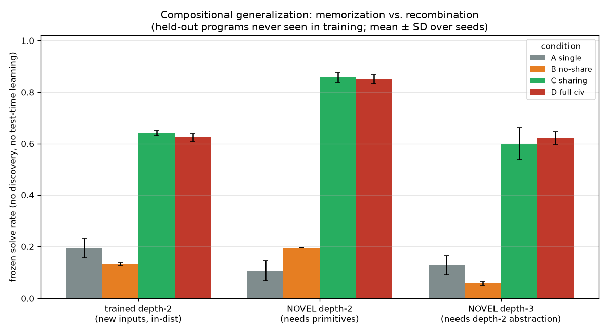
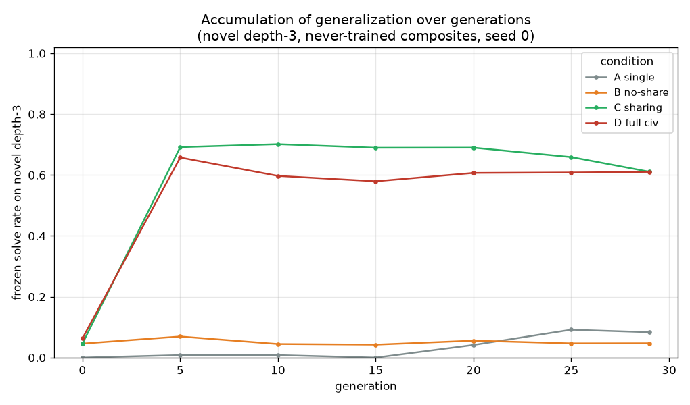

This converts the headline from "knowledge accumulates" to the stronger,
falsifiable claim it survived: **the civilization accumulates reusable
intermediate abstractions and recombines them to solve problems it never saw.**
A clean null here would have been reported just as loudly; it wasn't a null.

---

## 5. How culture actually spreads (networks)

In the full civilization, **27 explicit teaching transfers** occurred between
agents (logged in the `propagation` table), on top of vertical inheritance.


*Figure 3 — Skill-propagation network: directed edges are teacher → student
transfers. Culture visibly flows through the population.*


*Figure 4 — Agent relationship network: affinity ties formed through successful
teaching and cooperation, node colour ∝ reputation.*

A control observation: in conditions A and B these graphs are **empty** — no
sharing channel exists, so no culture forms. The networks are a direct visual of
*why* C and D pull ahead.

---

## 6. Scaling up: computer use & autonomy

The deep question (from the brief) is whether *generation N has capabilities
generation 1 could never reach*. The next three experiments push that idea up the
abstraction ladder, toward genuinely capable, tool-using agents.

### 6.1 Experiment E — Computer World (operate a simulated VM)

Agents operate a simulated computer (a virtual filesystem + a working register)
via shell-like operations (`read_input`, `find`, `grep`, `sort`, `uniq`,
`count_lines`, `write_output`, …). Solutions are multi-step **programs**; learned
programs become reusable **macros** that are shared, inherited, and **modified**
(insert one op) to build the next, harder macro. An **auto-curriculum** raises the
difficulty whenever the population masters the current level (1 = *copy a file*,
5 = *locate → filter → sort → de-duplicate → count → write*).


*Figure 12 — **The headline scaling result.** The full civilization (red/orange)
climbs the curriculum from level 1 to level 5 and sustains it; an identical
no-sharing control (blue) collapses to mastered-level 0 once tasks exceed what a
single lifetime can discover.*

| Computer civilization | Frontier reached | Mastered level (final) | Mean reward (7,200 tasks) |
|---|---|---|---|
| **With culture** | **5 / 5** | 5 | **0.959** |
| No sharing (control) | 3 (offered) | **0** | 0.161 |

The control's mean task reward of **0.16** vs the full civilization's **0.96** is
the whole story in one number: without a culture to inherit, the churning
population never builds the macros that deep tasks require.


*Figure 13 — Per-level solve rate for the full computer civilization. Each deeper
level only becomes solvable after the macros from the level below have
accumulated.*

### 6.2 Experiment F — Real Computer World (genuine sandboxed `bash`)

To prove the skills are *real*, every primitive op is mapped to an **actual
coreutils command** (`cat`, `grep`, `sort`, `uniq`, `wc`, `tr`, `tac`, `cp`) run by
`bash` in a throwaway temp sandbox (whitelisted commands, `shlex`-quoted args,
`PATH`-only env, timeout, **no network**). An agent's macros transfer **unchanged**
from the simulated world to the real shell.

| Level | Task | Cultured agent | Fresh agent (budget 30) |
|---|---|---|---|
| 1 | copy_file | ✅ (2 real cmds) | ✅ (18 cmds) |
| 2 | upper_file | ✅ (5 cmds) | ❌ |
| 3 | grep_count | ✅ (23 cmds) | ❌ |
| 4 | grep_sort_count | ✅ (23 cmds) | ❌ |
| 5 | grep_upper_reverse_count | ✅ (23 cmds) | ❌ |

The cultured agent solved **5/5**; the fresh agent solved **1/5** before exhausting
its real-execution budget. A real command trace the agent actually executed in its
sandbox (level 5, keyword *"north"*):

```bash
cat -- tower.txt > ._reg
grep -F -- north ._reg > ._tmp || true; mv ._tmp ._reg
grep -c . ._reg > ._tmp || true; mv ._tmp ._reg
cp ._reg output.txt
# produced '1'  (expected '1')  ✓
```


*Figure 14 — Real shell commands executed to solve each level. Green (cultured)
solves everything cheaply; red (fresh) fails levels 2–5 even after burning its
whole budget.*

### 6.3 Experiment G — Autonomous Operation World (run a business, forever)

The highest abstraction: a firm of specialised agents runs **continuously** (120
business days here, but the loop never terminates by design). Each day a customer
**order** arrives as a bundle of sub-tasks at varied difficulty; a manager
**decomposes** it and **delegates** each sub-task to the best-suited specialist
(load-balanced). Fulfilled work earns **revenue**, wages are a **cost**, the
**treasury** compounds, and **workers retire after a bounded tenure** — so
institutional knowledge (a shared knowledge base inherited by new hires), *not*
individual veterans, must carry the firm. As the firm succeeds, its **ambition**
(hardest order level it sells) ratchets up.


*Figure 15 — Cumulative profit over 120 days. The firm **with** a shared knowledge
base (green) compounds to **+426** and sustains order sophistication level 5; an
identical firm **without** institutional memory (red) drifts to **−92** — it goes
to a loss because every retiring worker takes its private skill with it.*

| Firm | Final cumulative profit | Final ambition | Mean task reward |
|---|---|---|---|
| **With shared knowledge base** | **+426** | level 5 | 0.565 |
| Without knowledge base | **−92** | level 5 | 0.421 |

**Emergent division of labour** appeared too: by the final day the surviving
workforce had settled into distinct specialties (e.g. L1, L2, and L5 specialists),
and orders were routed to them.

### 6.4 Computer-Use Benchmark — "do they actually become computer-use agents?"

Experiments E–G show culture *helps*, but the operator asked the blunt question:
take the end-product of the civilization — an agent carrying the macro library a
Computer-World civilization accumulated over generations — and a **fresh gen-0
agent**, and march both up a **graded ladder of real computer projects**, from the
trivial ("move this file") to the open-ended ("write a web app"). **How far up does
each actually get?** Every solvable rung is graded by **executing the agent's
synthesised program as real shell commands** in a throwaway sandbox (`mv`, `cp`,
`grep`, `sort`, `uniq`, `wc`, …) — a "solve" means real files changed on a real
disk, not a simulation. Both agents get an identical, generous synthesis budget
(4000 evaluations), so this measures *what each can express*, not who searches
faster.

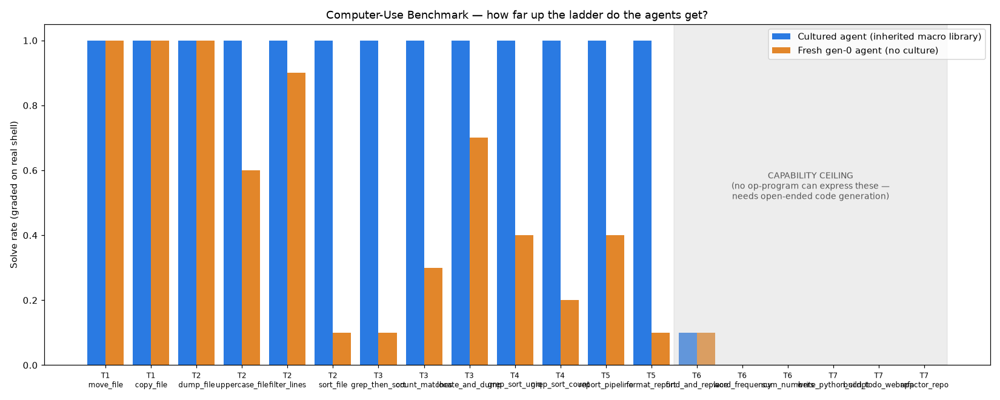
*Figure 18 — Solve rate per rung (10 trials), graded on the real shell. The
cultured agent (blue) clears **every reachable rung, T1→T5, at 100%**; the fresh
agent (orange) handles the 1–2 step rungs but **collapses as depth grows** (sort,
grep+sort, the 5-stage report pipeline → ~0–0.4). The grey band is the **capability
ceiling**: rungs no op-program can express.*

| Rung tier | Example project | Cultured | Fresh |
|---|---|---|---|
| T1 (1 op) | move / copy a file | 1.00 | 1.00 |
| T2 (3 ops) | uppercase / filter / **sort** a file | 1.00 | 0.10–1.00 |
| T3 (3–4 ops) | grep→sort, count matches, locate→dump | 1.00 | 0.10–0.70 |
| T4 (5 ops) | grep→sort→uniq, grep→sort→count | 1.00 | 0.20–0.40 |
| T5 (6 ops) | full report pipeline, format report | 1.00 | 0.10–0.40 |
| **Mean over 13 reachable rungs** | | **1.00** | **0.52** |
| T6 | find-and-replace, word-frequency, sum numbers | — was UNREACHABLE; **now reached, see §6.5** — | |
| T7 | write a Python script / Flask app / refactor a repo | — was NOT REPRESENTABLE; **csv-script now reached, §6.5; group-by, §6.6** — | |

Two honest boundaries are drawn, not hidden:

* **T6** tasks (in-place substitution, counting *distinct* words, arithmetic) are
  *runnable* but a bounded **oracle search over the entire op-vocabulary** (all
  programs up to depth 4) cannot hit the target — so we mark them out-of-class
  rather than pretend the agents "failed" them. This is the honest edge of a fixed
  op-vocabulary: no amount of culture invents a primitive that isn't there.
* **T7** tasks need open-ended *code generation* across an unbounded action space —
  not a single-file text transform — so they are not representable in this world at
  all. That is precisely the gap between what this project breeds (bounded,
  multi-step file/text **tool-users**) and a "write me an app" agent.

**The finding.** Within the representable class, the civilization's accumulated
culture is exactly what turns a fresh agent — competent only at 1–2-step chores —
into one that reliably executes **deep, multi-stage real-shell pipelines**. The
cultured agent is, operationally, a genuine (if narrow) computer-use agent; the
fresh one is not. Culture didn't just speed up search — it **lifted the depth of
task the agent can reliably complete on a real machine**, which is the whole point.

---

### 6.5 Computer-Use Frontier — actually reaching the locked rungs

§6.4 stopped at two honest walls and named them rather than hiding them. The
operator then asked the obvious follow-up: *what would it take for the agents to
actually hit those remaining levels?* We brainstormed the option space
(`COMPUTER_USE_FRONTIER.md`) and built the two mechanisms that knock the walls
down — still with **no pretrained model**, and still gated by culture.

**Tier 6 → reached, via parametric ops + argument-by-example.** Operations gain
*holes* for arguments (`replace(<find>,<repl>)`, `prefix_lines(<text>)`), and the
agent **infers the hole-fillers from input→output examples** — programming-by-
example, the FlashFill idea, fully non-LLM. The `find`/`repl` literals are mined
from the example diffs (a token that *disappeared* / *appeared*); two reductions
(`word_freq`, `sum_numbers`) cover the non-literal cases. A learned skill is now a
*templated macro* — an op-sequence with holes — refilled per task, so it
generalises across instances.

**Tier 7 → one rung reached, via grammar-guided code synthesis.** A second action
space: the agent emits a program in a tiny typed grammar that **compiles to real
Python**, which we **execute in a subprocess against hidden tests**, keeping the
first that passes all of them. The *"write a Python script that reads a CSV and
prints column averages"* rung moves from **not representable** to **reachable and
really run**.

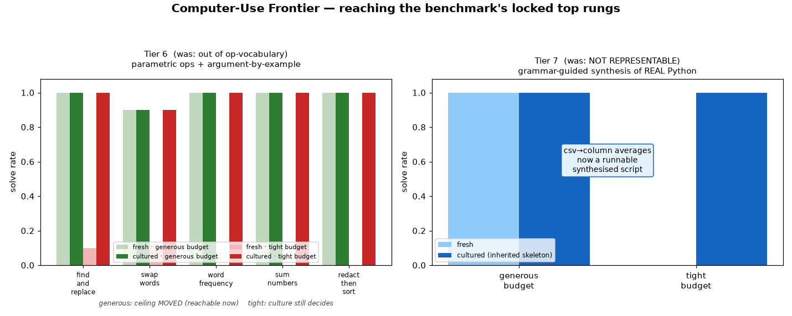

We report two budget regimes so the claim stays honest — *generous* ("did the
ceiling move?") and *tight* ("does culture still decide?"). Seed 0, 10 trials
(`results/frontier.json`):

| rung (was locked) | generous: fresh → cultured | tight: fresh → cultured |
|---|:---:|:---:|
| T6 find_and_replace | 1.00 → 1.00 | 0.10 → 1.00 |
| T6 word_frequency | 1.00 → 1.00 | 0.00 → 1.00 |
| T6 sum_numbers | 1.00 → 1.00 | 0.00 → 1.00 |
| T6 redact_then_sort *(composite)* | 1.00 → 1.00 | 0.00 → 1.00 |
| T7 csv → column averages *(real Python)* | 1.00 → 1.00 | 0.00 → 1.00 |

**The finding.** Both tiers are now genuinely reachable — and the result keeps the
exact shape of the rest of the project: the unlocking mechanism is **expensive to
discover, cheap to inherit**, so under a tight budget a cultured agent recalls it
in ~1–3 tries while a fresh agent (16–147 tries to discover) **cannot reach it**.
The ceiling **moved up two tiers**, and culture **still decides who clears it**.
The remaining T7 rungs (Flask app, repo refactor) need a multi-file action space
and stay out of reach — an honest, *moved* ceiling, not a vanished one.

### 6.6 Computer-Use Frontier, Tier 8 — group-by aggregation (the next rung up)

§6.5's reached Tier-7 rung was a *flat* per-column reduction: read a CSV, reduce
each column, print. Real tool-use work climbs past that into programs that **build
and iterate a data structure**. So we pushed one rung higher — a genuinely harder
program — to test whether the same culture-decides law keeps holding as the
synthesised code gets more complex:

> **Tier 8 — group-by aggregation.** *"Read a CSV, group rows by a key column,
> aggregate a value column per group, print sorted `key:value` pairs."*

This needs a dict accumulator and a two-pass shape (accumulate per key, then
reduce-and-emit) — and the agent must discover *which* column is the key, *which*
is the value, and *which* of five reductions, **none of which it is told**. It is
synthesised exactly as honestly as Tier 7: the agent emits a program in a tiny
typed grammar that **compiles to real Python**, which we **run in a subprocess
against hidden tests** (`echo_civilization/codegen2.py`), keeping the first that
passes all of them. No pretrained model is involved anywhere.

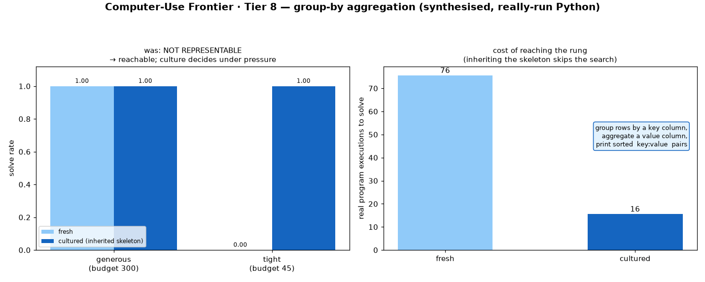

**Example output from an actual run.** This is the program the synthesiser kept
(seed 0) — verbatim, and the hidden transform here was *group by column 1, **mean**
of column 2*:

```python
import sys, csv
path = sys.argv[1]
with open(path, newline='') as fh:
    rows = list(csv.reader(fh))
rows = rows[1:] if rows else rows   # drop header
groups = {}
for row in rows:
    try:
        k = row[1]
        x = float(row[2])
    except (IndexError, ValueError):
        continue
    groups.setdefault(k, []).append(x)
out = []
for k in sorted(groups):
    v = groups[k]
    r = sum(v) / len(v)
    rs = str(int(r)) if float(r).is_integer() else str(r)
    out.append(k + ':' + rs)
print(' '.join(out))
```

Run for real on a **held-out** CSV it had never seen during synthesis:

```
$ cat data.csv              $ python prog.py data.csv
c0,c1,c2                     green:35.8 red:18.5
32,red,24
6,green,49                   # expected: green:35.8 red:18.5   → MATCH
29,green,28                  #   green = (49+28+21+47+34)/5 = 35.8
36,green,21                  #   red   = (24+13)/2          = 18.5
35,red,13
4,green,47
42,green,34
```

The program is correct, not memorised: it recovers the right columns and reducer
and generalises to a fresh instance.

**The result (seed 0, 10 trials, `results/tier8.json`), two budget regimes:**

| regime | budget | fresh | cultured | real program executions to solve |
|---|:---:|:---:|:---:|---|
| **generous** (did the ceiling move?) | 300 | **1.00** | **1.00** | fresh **76** vs cultured **16** |
| **tight** (does culture still decide?) | 45 | **0.00** | **1.00** | — |

Seed 1 reproduces this exactly (generous 1.00/1.00 at 76 vs 16 executions; tight
0.00/1.00) — the separation is not a seed artefact.

**The finding.** Tier 8 is genuinely reachable now — and the law holds one rung
higher than §6.5. The structural skeleton (`group_by_aggregate`) is **expensive to
discover** — a fresh agent must grind through every wrong skeleton's parameter grid
first (~76 real executions) before it even reaches the right shape — but **cheap to
inherit**: an agent handed the skeleton from culture jumps straight to it and only
searches the small parameter tail (~16 executions). Squeeze the budget to 45 and
that gap becomes a wall: the fresh agent **cannot reach the rung at all (0.00)**
while the cultured agent **clears it every time (1.00)**. The ceiling moved up
another rung, by mechanism not scale, and culture still decides who clears it.

---

## 7. Adaptability to a novel task family

§4.4 showed culture survives novel *compositions*. But every held-out task there
was still the same KIND of task the population trained on — apply one program to one
string. The operator's harder steer: can the civilization adapt to a task type it
has **never seen in its entirety**? Full write-up: **`ADAPTABILITY_FINDINGS.md`**.

**The novel family — higher-order combinators.** The eval introduces a structural
layer nobody trained on: a *combinator* `C` that decides HOW an inner transform `f`
is mapped across a multi-token input (`map_each`, `map_reversed`, `first_only`,
`last_only`, `map_evens`). Solving a task requires recovering BOTH the combinator
(novel to everyone) and the inner depth-2 `f`. Because **no agent ever trained on a
combinator**, the combinator confers no inherited edge — both agent types meet it
for the first time at eval. The only thing a cultured agent carries is its library
of inner abstractions `f`. So the test isolates exactly one thing: *does carrying
accumulated abstractions help you adapt to an unfamiliar problem structure?*

**A worked trace** (strongest cultured agent vs. a fresh gen-0 agent, identical
tight budget of 45 consistency checks; eval is frozen, query-judged):

```
TRUE RULE (hidden):  map_reversed(reverse then inc1)
DEMOS:   'ab gg ed'  -> 'ef hh cb'      'ehf hee'  -> 'ffa gaf'
         'ccba beh'  -> 'afc bcdd'      ...
QUERY:   'hfg ef ced' -> 'efd gf hga'   (decides correctness)

CULTURED (D): knows inner abstraction -> hypothesis map_reversed(reverse,inc1)
              via known=True, 27 checks  -> SOLVED ✓
FRESH (gen-0): empty library, spends all 45 checks on single-op inner
               candidates, never reaches the depth-2 inner -> gave up ✗
```

Same task, same budget; the only difference is the inherited library.

**Results** (frozen solve rate on the 100-task novel family, mean ± SD over seeds
0/1/2; the oracle that knows the inner `f`'s solves **1.00**, proving every task is
solvable-in-principle):

| Condition | TIGHT budget (45) | generous budget (4000) | avg known skills |
|---|---|---|---|
| A — single agent | 0.55 ± 0.25 | 1.00 | 4.0 |
| B — population, no sharing | 0.47 ± 0.03 | 1.00 | 3.8 |
| C — population + sharing | **0.90 ± 0.02** | 1.00 | 15.0 |
| D — full civilization | **0.91 ± 0.02** | 1.00 | 14.6 |
| FRESH — gen-0, no accumulation | 0.22 ± 0.00 | 1.00 | 0.0 |

At the generous budget **everyone reaches the ceiling** (the novel combinator is
findable given enough blind search), so the family is not impossible. But under the
TIGHT budget, **the inherited library decides adaptation**: best cultured **0.91**
vs. fresh **0.22**, a **+0.69** gap. (A is a single, high-variance agent that
happened to accumulate a few abstractions in its own lineage; FRESH is the clean
zero-accumulation control.) Crucially this is *not* memorization of the new task
type — nobody saw a combinator — it is the **reuse of old abstractions as building
blocks inside a new control structure discovered on the spot.**

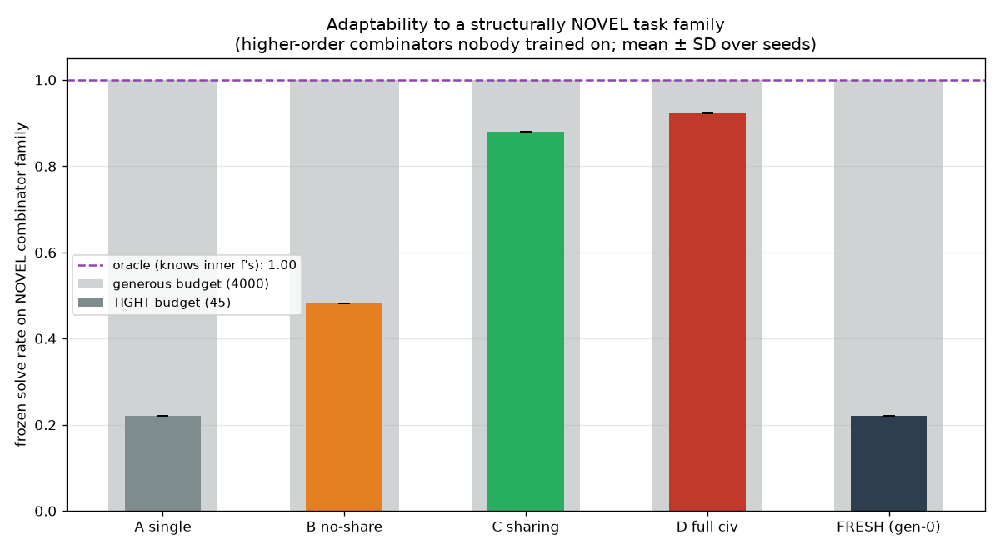
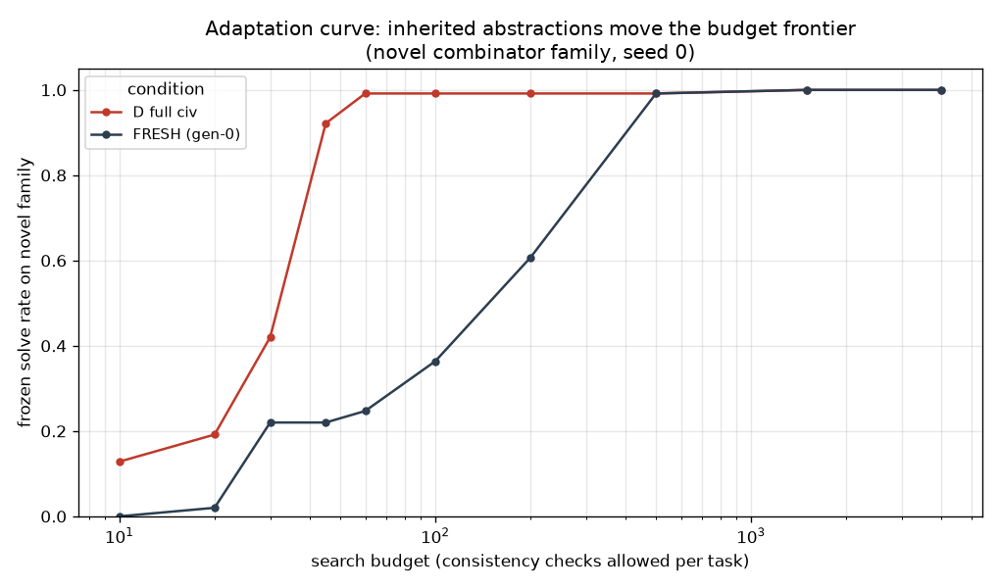

The adaptation curve reframes the gap as a **frontier shift**: the cultured
civilization reaches the ceiling at a small budget; a fresh agent needs an order of
magnitude more search to get there. Carrying abstractions moves the budget frontier
for a problem type the abstractions were never collected for — the strongest form of
cultural accumulation the project set out to test.

---

## 8. Parametric abstraction — inheriting a schema with a free argument

§7 widened the held-out family but the unit culture transmitted was still a
**concrete** program. The operator's next steer: can the civilization transmit an
**abstraction with a free parameter** — the schema `shift_by(k)` rather than the
concrete `shift_by(2)` — so a later agent can **bind that parameter to a value it has
never seen**? Full write-up: **`PARAMETRIC_FINDINGS.md`**.

**The new axis — argument binding.** The eval is built from six *parametric*
families (`shift_by`, `shift_back`, `rotate`, `take`, `drop`, `repeat`), each a
family `f(k)` with an integer argument. An inherited **schema** is the family name
*plus an inverter* that recovers the argument from one (input, output) pair in O(1).
The cultural loop is faithful to the brief's diagram: an agent solves a LOW-argument
instance (args 1/2, blind-reachable) → **abstracts the specific argument away** into a
schema → shares it → the next generation inherits it → a later agent **binds a NOVEL
high argument** (3/4/5, never seen by anyone). The inner transform (identity/reverse)
is known to all and the bound argument is novel to all, so the **only** lever is
schema possession — this is not memorisation.

The blind-search grid is deliberately larger than the cultural library: **14
families** (6 real + 8 DECOY distractors that never appear in any task). Cultural
selection (a recurrence gate, ≥2 distinct solves) prunes one-off decoy coincidences,
so a cultured population inherits only the 6 real families; a fresh agent has no way
to know the decoys are useless and must waste budget ruling them out.

**A worked trace** (strongest cultured agent vs. a fresh gen-0 agent, identical tight
budget of 40 checks; eval is frozen and query-judged; argument `k`=5 never seen in
training):

```
TRUE RULE (hidden):  repeat(5) then reverse
DEMOS:   'bhefgbh'  -> 'hbgfehbhbgfehbhbgfehbhbgfehbhbgfehb'   (×5, reversed)
         'fcfbhbc'  -> 'cbhbfcfcbhbfcfcbhbfcfcbhbfcfcbhbfcf'   ...
QUERY:   'agddechb' -> 'bhceddgabhceddgabhceddgabhceddgabhceddga'  (decides correctness)

CULTURED (D): inherited schema for `repeat` -> inverts k=5 from one pair
              via inherited schema=True, 6 checks  -> SOLVED ✓
FRESH (gen-0): no schema, blind-sweeps the 14-family × 7-arg × 2-inner grid,
               budget exhausted before reaching repeat(5) -> gave up ✗
```

Same task, same budget; the only difference is the inherited schema.

**Results** (frozen solve rate on the 108-task novel high-argument suite, mean ± SD
over seeds 0/1/2; the oracle holding every schema solves **1.00**, proving every task
is solvable-in-principle):

| Condition | TIGHT budget (40) | generous budget (4000) | avg real schemas inherited |
|---|---|---|---|
| A — single agent | 0.34 ± 0.08 | 1.00 | 0.3 |
| B — population, no sharing | 0.29 ± 0.01 | 1.00 | 0.2 |
| C — population + sharing | **1.00 ± 0.00** | 1.00 | 6.0 |
| D — full civilization | **1.00 ± 0.00** | 1.00 | 6.0 |
| FRESH — gen-0, no accumulation | 0.25 ± 0.01 | 1.00 | 0.0 |

At the generous budget **every condition reaches 1.00** (any argument is findable
given enough blind search), so the suite is not intrinsically hard. But under the
TIGHT budget the inherited schema **decides**: cultured **1.00** vs. fresh **0.25**, a
**+0.75** gap — created entirely by inheriting parametric schemas, even though the
argument those schemas bind is novel to every agent. A/B stay low because without
inheritance only the *last* generation's within-run discoveries survive into the
final population.

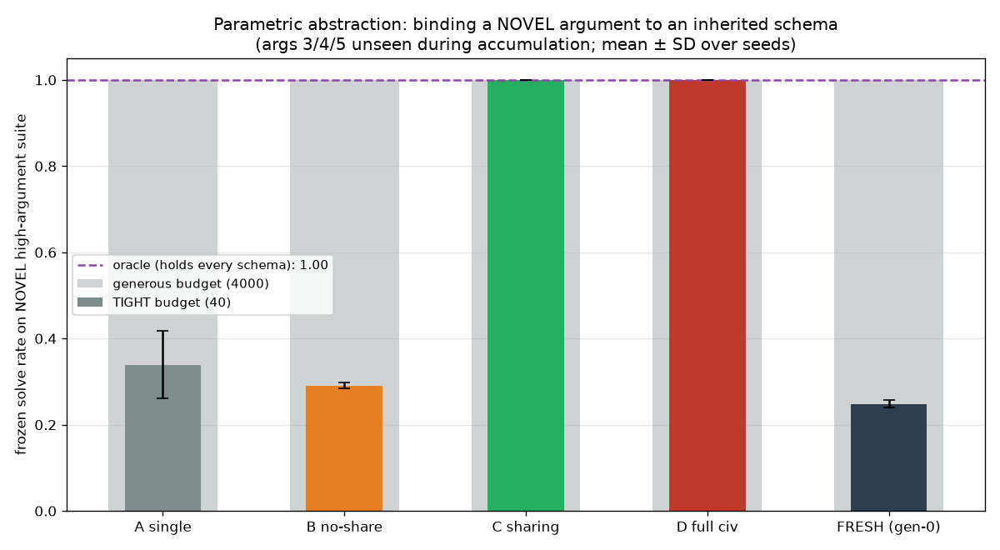
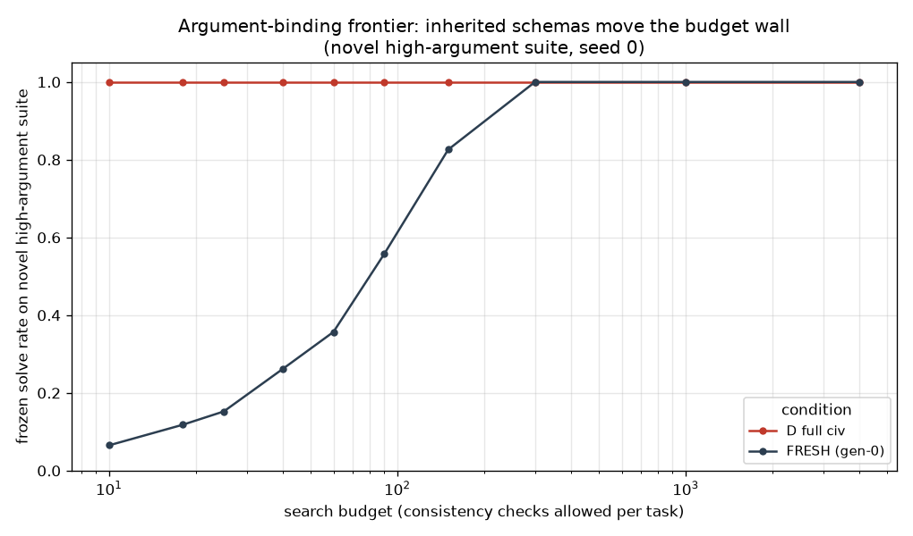

This is a strictly more general form of inheritance than every earlier study: the
unit of accumulated cultural knowledge is no longer a fixed program but an
**abstraction with a slot**, and a descendant can fill that slot with a value its
ancestors never used.

---

## 9. Building real applications from a one-line prompt

Every world up to here transmitted *transforms* — string ops, shell pipelines,
parametric schemas. The operator's final steer aimed at what larger models are
prized for: **take an under-specified task ("build a website that does X") and
produce a working application.** Experiment J — **Builder World** — does exactly
that, the same honest way the rest of the project works: **no pretrained model
anywhere**, agents emit **real JavaScript**, that JavaScript is **executed in Node**
against hidden behavioural tests, and an app counts as "built" only when every
requirement passes for real. Full write-up: **`BUILDER_FINDINGS.md`**.

**What it produces.** From five one-line prompts the civilization builds five real,
openable apps in `output_apps/` — `counter`(3 features), `tip_calculator`(3),
`todo`(3), `shopping_cart`(4), `notes`(6) — each an `index.html` + assembled
reducer. Here is the 6-feature frontier app `notes`, *verbatim as the strongest
cultured agent emitted it* (`output_apps/notes/app.js`):

```js
function dispatch(action, payload) {
  switch (action) {
    case "ADD":    { state.items.push({text: payload, done: false}); break; }
    case "REMOVE": { state.items.splice(payload, 1); break; }
    case "EDIT":   { if (state.items[payload.i]) state.items[payload.i].text = payload.text; break; }
    case "TOGGLE": { if (state.items[payload]) state.items[payload].done = !state.items[payload].done; break; }
    case "FILTER": { state.filter = payload; break; }
    case "CLEAR":  { state.items = []; break; }
  }
}
```

No template filled this in — each `case` body is a **component** the agent either
discovered by running candidate code in Node or recalled from inherited culture,
and the file exists only because all six behavioural tests passed on this exact code.

**The two mechanisms** are the operator's two hints made literal:

- **Decomposition ("the sub-task thing").** A vague spec is split into **one
  sub-task per user action**. Each sub-task is "find the handler whose tests pass
  for THIS behaviour." This turns a **multiplicative** joint search
  (`|handlers|^features`) into an **additive** one. The same budget that can't touch
  the joint space comfortably covers the sum of parts.
- **Culture.** Each solved handler is a reusable named **component** keyed by its
  action, contributed to a shared library, inherited by later agents, and **tried
  first**. A cultured agent plugs in an inherited `add_text` for ~1 trial; a fresh
  agent blind-searches a grid (22 components: 14 real + 8 decoys) per sub-task and,
  across a multi-feature app under a tight budget, runs out before assembling all.

**Three conditions × seeds 0/1/2, POP=5, GEN=8, BUDGET=40, 3,325 real Node runs.**
Frontier = max features in a fully-built, test-passing app:

| Condition | Gen 1 → Gen 8 frontier | Result |
|---|---|---|
| A — monolithic (no decomp, no culture) | 0 → 0 (flat) | builds **nothing** (joint space ≫ budget) |
| B — decomposed, no culture | ~4.7 → ~4.7 (flat, noisy) | builds, but frontier **never rises**; fluke-6s evaporate next gen |
| C — decomposed + culture | 4.7 → **6.0** (climbs, holds) | reaches the **6-feature** ceiling by gen 2 and stays; library 13–14 → **16** |

Per-spec single-agent build rate, **fresh vs. cultured** (budget 40, n=27 each):
counter **.81→1.00**, tip_calculator **.52→1.00**, todo **.85→1.00**,
shopping_cart **.33→1.00**, notes **.07→1.00**. The harder the app, the more
decisive culture is: the 6-feature `notes` is essentially **unbuildable fresh** and
**always buildable** with an inherited library.

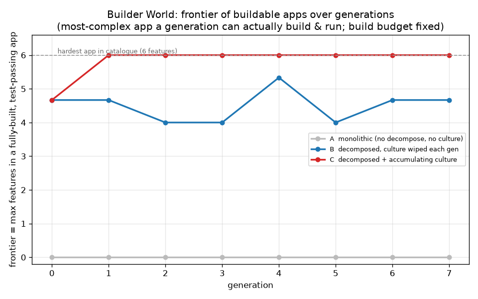
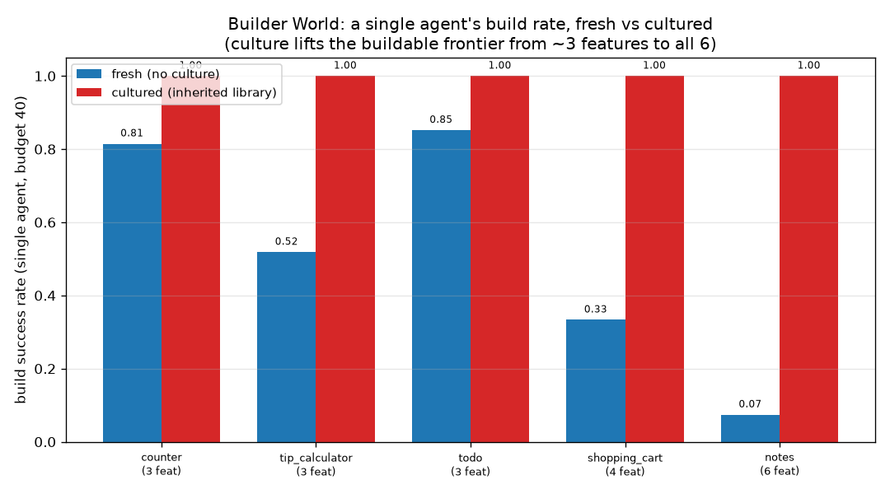
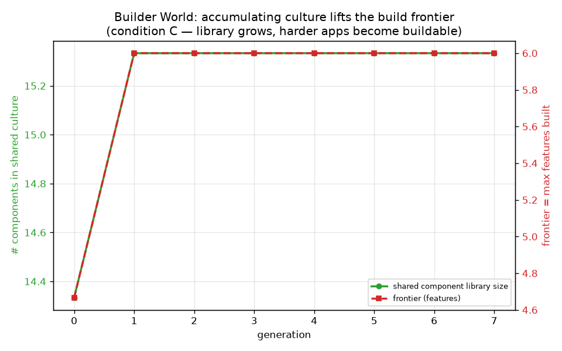

**Why it accumulates.** `notes` shares the action names `ADD/REMOVE/TOGGLE` with
`todo`; once `todo` is built those components are in the culture and get recalled in
~1 trial, freeing budget for the three `notes`-specific behaviours (`edit_at`,
`set_filter`, `clear_items`) a lucky agent discovers once — which then enter culture,
making every later `notes` build one-shot. **A monolithic** builder never gets that
far: without decomposition the joint search builds nothing at all. **B** shows
decomposition makes building *possible* but not *cumulative* — each generation
restarts from empty, so a fluke-6 never compounds. **C** shows culture makes the
frontier *climb and hold*. This is the project's thesis one level higher: the
limiting resource for hard construction is not per-agent compute but accumulated
culture — generation N ships an app generation 1 could not, because the components
survived. (Honest limit: the 22-component library is fixed; agents *compose and
discriminate*, they don't author arbitrary novel files — that frontier is §6.5–6.6.)

---

## 10. Building bigger: resilient full-stack apps

Builder World (§9) built single-file reducer apps. The operator's last steer pushed
further: *"they needed a heavy harness and it hardly worked — make the agents more
resilient and able to actually make bigger projects across the entire dev stack."*
Experiment K — **Stack World** — answers it. Agents assemble **real multi-file Node
projects** spanning the whole stack — `db.js` (data) + `validate.js` + `app.js` (HTTP
router) + `server.js` (a bootable `http` server) + `public/index.html` (a `fetch`
frontend) + `package.json` — and every grade is a **real `node` execution** against
hidden behavioural tests. Full write-up: **`STACK_FINDINGS.md`**.

**What it produces.** Four real, bootable backends in `output_apps/` from one-line
prompts: `task_api` (5 endpoints), `blog_api` (10), `shop_api` (15), `platform_api`
(20 endpoints across 4 resources). All four **boot and round-trip over real HTTP** —
`boot_and_probe` starts the server, POSTs a record, GETs it back, confirms it
persisted (`stack_probes.json`, every `boot_ok: true`). Here is the live `task_api`
driving its own API in a browser:


**Two mechanisms, two different jobs.** A handler is a config of flags (`create` has
`status` / `result` / `validate`), each flag pinned by its own hidden test, so a
defect is one failing test and the repair landscape is smooth.

- **Resilience (repair).** A `BRITTLE` agent blind-enumerates the preset pool per
  endpoint (multiplicative; the correct config is rare among one-flag-off
  near-misses). A `RESILIENT` agent grades its first candidate and **hill-climbs
  single-flag edits to a passing config** (additive), and a partial project still
  emits and boots.
- **Culture (typed transfer).** REST endpoints come in five **types**
  (create/list/read/update/delete) that recur across resources. Proven configs are
  shared by type and accumulate; a `create` debugged on `tasks` is inherited by
  `posts`, `users`, `likes`, … and tried first.

**Four conditions × seeds 0/1/2, POP=5, GEN=8, budget=90, repair=45, 3,666 real
Node runs.** Frontier = largest fully-built, test-passing app (endpoints):

| Condition | Gen 0 → Gen 7 frontier | Result |
|---|---|---|
| BRITTLE | 2.3 → 3.0 (flat) | can't even reliably finish the 5-endpoint API |
| RESILIENT | 4.3 → 5.3 (flat) | finishes small apps every time; bigger out of reach |
| BRITTLE+CULTURE | 2.3 → **20.0** | climbs to the 20-endpoint platform by gen 1, holds |
| RESILIENT+CULTURE | 4.3 → **20.0** | climbs to 20 and holds; every agent builds every app |


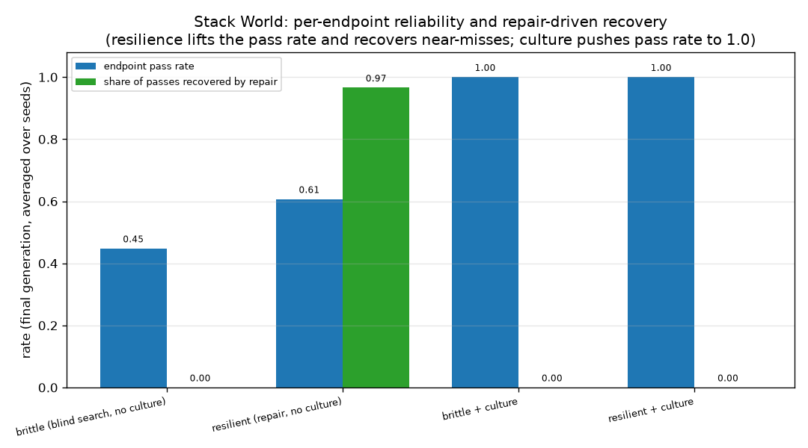
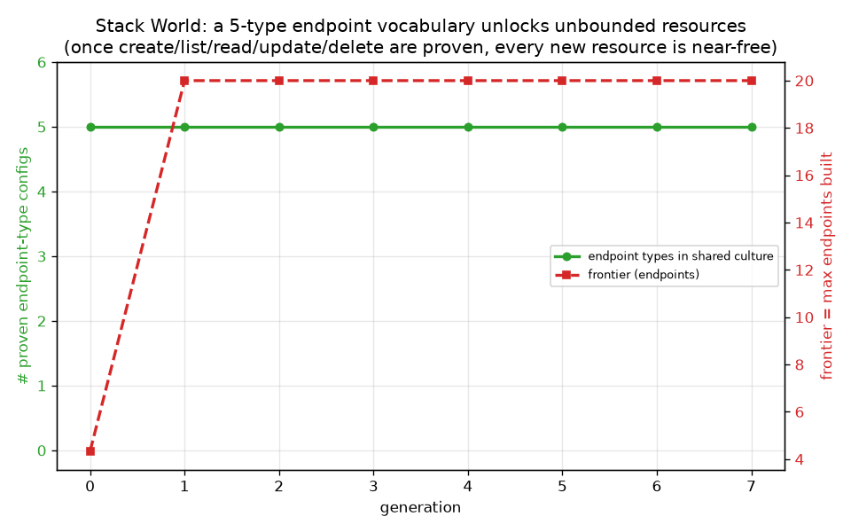

**The honest split.** The frontier climb to 20 is **culture's** doing, not
resilience's: both cultured conditions reach it, because a *population* discovers the
five-type vocabulary within a generation whether its members repair or blind-search.
What resilience buys is **per-agent reliability** — measured at the final generation,
no culture: endpoint pass rate **0.45 → 0.61**, project completion **0.15 → 0.27**,
no-culture frontier **3.0 → 5.3**, and the decisive number, **recovery = 0.97** (97%
of a resilient agent's passing endpoints were reached by *debugging a near-miss*, not
by guessing right cold). Completion by app size (out of 15 attempts): brittle finishes
the 5-endpoint API 9/15 and nothing larger; resilient finishes it 15/15 and flukes a
10-endpoint build 1/15; **resilient+culture builds all four — including the
20-endpoint platform — 15/15.** Once the vocabulary is inherited the config is right
first try, so recovery drops back to 0.00: resilience keeps each agent on its feet
while the vocabulary is still being discovered; culture removes the need for it once
it is. Neither alone ships the big app reliably; together they do. (Honest limit:
handlers are configs of preset flags repaired flag-by-flag, not free-form route code;
the data layer, router, and server are fixed scaffolding.)

---

## 11. Conclusions

1. **Knowledge accumulates culturally — strongly.** With identical per-agent
   budgets, sharing/inheritance conditions reached **96–97 %** hard-task capability
   while isolated/non-sharing baselines stayed near **50 %**. Generation 30 solves
   composite and deep tasks generation 1 could not, *because the building blocks
   entered the shared culture.* **H1 supported.**

2. **The mechanism is recombination of inherited skills.** Culture turns an
   exponential blind search into a short composition over known skills (visible as
   the per-agent library quadrupling and behavioural depth rising).

3. **Vertical inheritance does most of the work; teaching adds a little.**
   Conditions C and D finish neck-and-neck (97 % vs 96 %) — once skills are pooled
   and inherited, extra horizontal copying is largely redundant *in this task
   family.*

4. **All subsystems work independently** (H1a–d): Q-learning masters copying by
   episode 6; memory decays and transfers; an evolved neural net improves on the
   physical grid; and a shared language emerges from meaningless symbols to 100 %
   accuracy.

5. **The principle scales to tool use** (H1e): in both a simulated VM and a **real
   sandboxed shell**, cultured agents climb to deep multi-step pipelines while
   knowledge-less agents stall — mean task reward 0.96 vs 0.16 in the computer
   world.

6. **And to sustained autonomy** (H1f): a firm with institutional memory compounds
   profit and rising sophistication forever, while an identical firm without it
   goes bankrupt. *Institutional knowledge is the difference between a viable and a
   failing autonomous operation.*

7. **The end product is a genuine (narrow) computer-use agent** (§6.4). Graded by
   executing real shell commands, the cultured agent clears **every reachable rung
   (T1→T5) at 100 %**, while the fresh gen-0 agent (mean **0.52**) handles only
   shallow chores and collapses on deep pipelines. Culture lifts the *depth* of
   real-machine task an agent reliably completes — and the benchmark also draws the
   honest ceiling: tasks outside the fixed op-vocabulary, and open-ended code
   generation, remain out of class no matter how rich the culture.

8. **And those frontiers are movable — by mechanism, not by scale** (§6.5). Adding
   *parametric operations with argument-by-example* and a *grammar that synthesises
   real Python* takes the previously locked Tier-6 and one Tier-7 rung from
   unreachable to reached — and the same law holds two tiers higher: the unlocking
   skill is expensive to discover and cheap to inherit, so under a tight budget the
   cultured agent clears the new rungs and the fresh agent still cannot. No
   pretrained model was used; the ceiling moved honestly, and culture still decides.

9. **The same law survives a genuinely harder program** (§6.6). Pushed one rung
   higher to **group-by aggregation** — a multi-statement Python program with a dict
   accumulator, synthesised and *really run* — culture still decides under pressure:
   at a tight budget the cultured agent clears it **100 %** of the time and the fresh
   agent **0 %**, because the structural skeleton costs ~76 real executions to
   discover but ~16 to recall. The frontier is not a fixed wall; it moves rung by
   rung as the unlocking abstractions accumulate.

10. **Accumulated abstractions confer ADAPTABILITY to never-before-seen task
   structures** (§7). On a novel family of higher-order combinators *nobody trained
   on*, a cultured civilization adapts under a matched tight budget (**0.91** solve
   rate) where a fresh agent fails (**0.22**) — a +0.69 gap that is pure
   inherited-library value, since the new control structure is discovered at eval by
   both. This is the project's central question answered in its strongest form:
   knowledge accumulated culturally for one purpose pays off on problems it was never
   collected for. Generation 30 doesn't just redo generation 1's tasks better — it
   *adapts to problems generation 1 could not have approached*, because the building
   blocks survived.

11. **Culture can transmit ABSTRACTIONS WITH A FREE PARAMETER, not just concrete
   programs** (§8). When the inherited unit is a parametric *schema* (`shift_by(k)`)
   rather than a fixed program, a cultured civilization binds a **novel argument**
   (3/4/5, unseen by anyone) under a matched tight budget (**1.00** solve rate) where
   a fresh agent fails (**0.25**) — a +0.75 gap, even though both reach the ceiling
   given a generous budget. This generalises the inheritance result one level up: the
   accumulated unit of knowledge is an abstraction with a slot, and a descendant can
   fill that slot with a value its ancestors never used.

12. **The same law builds real applications from a one-line prompt** (§9). Given
   vague specs ("build a to-do app") and no pretrained model, agents emit real
   JavaScript that is *executed in Node* against hidden tests; an app is "built" only
   when it really passes. Under a fixed build budget the **frontier of buildable apps
   rises across generations only with decomposition + culture**: a monolithic builder
   builds nothing (joint search ≫ budget), a decomposed-but-cultureless population
   plateaus (~4 features, flukes never compound), and a decomposed + cultured
   population climbs to the **6-feature** ceiling and holds. The hardest app is
   unbuildable fresh (**0.07**) and always buildable with an inherited component
   library (**1.00**). The civilization ships five real, openable apps in
   `output_apps/` — the accumulation thesis demonstrated on app construction itself.

---

## 12. Limitations & threats to validity

Honest caveats — this is a research toy, not a finished theory:

- **This is not AGI and does not claim to be.** The "computer" worlds use a fixed
  primitive instruction set; agents synthesise the *order* of operations, not
  free-form code, and do not set their own goals. What is demonstrated is the
  *mechanism* (cumulative, recombinable, inheritable skill) operating in a
  tool-use domain.
- **Capability starts well above zero.** Within a single lifetime agents already
  discover some primitives, so the generational *signal* is the upward slope of
  C/D, not an absolute zero start.
- **Narrow task domains.** Strings and file pipelines; the result should be
  replicated in richer domains before broad generalisation.
- **Single-seed headline numbers.** The string experiments report one seed; Exp E
  and G were spot-checked across seeds 0–2 and the qualitative result held. A
  multi-seed run with confidence intervals is the obvious next step.
- **Emergent protocols can be degenerate** (high consistency but low accuracy if
  two concepts collapse onto one symbol); parameters were chosen to avoid this,
  but the failure mode exists.
- **The firm result is sensitive to workforce churn.** With long-lived workers,
  individuals hoard skill and the knowledge-base advantage shrinks; bounded tenure
  (7 days) is what makes institutional memory decisive. This is a feature of the
  model worth stating plainly.

---

## 13. Reproducibility & data

```bash
python3 -m venv venv && ./venv/bin/pip install -r requirements.txt
./venv/bin/python run_experiments.py            # full run (~75 s)
./venv/bin/python run_experiments.py --quick     # fast smoke run
./venv/bin/python run_benchmark.py --trials 10   # §6.4 Computer-Use Benchmark (~60 s)
./venv/bin/python run_frontier.py --trials 10    # §6.5 Computer-Use Frontier (~2.5 min)
./venv/bin/python run_tier8.py --trials 10       # §6.6 Tier-8 group-by (~2 min)
./venv/bin/python run_generalization.py --seeds 0 1 2   # §4.4 generalization test
./venv/bin/python run_adaptability.py --seeds 0 1 2     # §7 adaptability to a novel family
./venv/bin/python run_parametric.py --seeds 0 1 2       # §8 parametric abstraction (schema + free arg)
./venv/bin/python run_builder.py --seeds 0 1 2          # §9 Builder World: build real apps in Node (needs node on PATH)
```

**Outputs**
- `RESEARCH_REPORT.md` — this document (human-authored: figures + stats + traces).
- `research_report.md` — the machine-generated companion (auto-written each run).
- `figures/01…27_*.png` — all 27 figures embedded above.
- `results/echo_civilization.db` — **all** raw data in SQLite.
- `results/benchmark.json` — Computer-Use Benchmark per-rung solve rates (§6.4).
- `results/frontier.json` — Computer-Use Frontier: Tier-6/7 unlock results (§6.5).
- `results/tier8.json` — Tier-8 group-by results + the synthesised source & run trace (§6.6).
- `results/adaptability.json` — adaptability solve rates, budget curves & worked trace (§7).
- `COMPUTER_USE_FRONTIER.md` — the brainstorm→build write-up for §6.5–§6.6.
- `results/parametric.json` — parametric-abstraction solve rates, budget curves & worked trace (§8).
- `results/builder.json` — Builder World frontier/build-rate data, library & emitted-app manifest (§9).
- `output_apps/{counter,tip_calculator,todo,shopping_cart,notes}/` — five real, openable apps the civilization built (§9).
- `ADAPTABILITY_FINDINGS.md` — the flagship §7 adaptability write-up (leads with run output).
- `PARAMETRIC_FINDINGS.md` — the flagship §8 parametric-abstraction write-up (leads with run output).
- `BUILDER_FINDINGS.md` — the flagship §9 Builder-World write-up (leads with a real generated app).

**Database contents (this run):**

| Table | Rows | What |
|---|---|---|
| experiments | 8 | one row per condition/world (A–D, E×2, G×2) |
| generations | 420 | per-generation metrics for every experiment |
| agents | 6,510 | per-agent snapshots (skills, reputation, lineage) |
| skills | 2,273 | every cultural skill over time (program, reputation, adoption) |
| propagation | 54 | teacher → student skill-transfer events |
| rewards | 33,360 | every individual task attempt (task, difficulty, reward, solved) |

Example query — *who taught whom, and which skill?*

```sql
SELECT generation, program, from_agent, to_agent
FROM propagation
WHERE experiment = 'D_full_civilization'
ORDER BY generation LIMIT 5;
```

Tech stack: Python + numpy + sqlite3 + matplotlib + networkx. No external AI APIs.
The architecture is modular: the `Learner` interface lets learning algorithms be
swapped, and every world plugs into the same agent/skill/culture/evolution core.

*Built as an artificial civilization laboratory, optimised to answer “does
intelligence accumulate?” — not to make one clever agent. The interesting result
is the slope, not the single point.*
