# Echo Civilization — Research Report
*An artificial-civilization laboratory testing whether knowledge accumulates across generations of simple learning agents.*
> Generated automatically by `run_experiments.py`. No pretrained models are used anywhere in this system; every capability shown is acquired from scratch through interaction.
## 1. Hypothesis
**Central research question.** *Can a population of simple learning agents accumulate knowledge and become more capable over generations through a civilization-like process?*
**Hypothesis (H1).** A population that shares and inherits discovered skills (a culture) will solve harder tasks over successive generations, while an isolated agent or a population without sharing will not — *even when every agent is given an identical, fixed problem-solving budget*. In other words, the limiting resource for hard tasks is not individual compute but **accumulated culture**.
**Sub-hypotheses.**
- H1a — individual agents can learn primitive skills from reward alone (Echo World, Q-learning).
- H1b — memory retains information but decays without reinforcement, and can be transferred between agents (Memory World).
- H1c — a different learning algorithm (an evolved neural network) improves across generations on a physical task (Grid World).
- H1d — a shared communication protocol can emerge from initially meaningless symbols (Social World).

## 2. Methods
### 2.1 Agents
Agents are **not** language models. Each agent has an identity (id, generation, parents), internal state (a swappable *learner*, a library of known *skills*, short- and long-term memory, behavioural preferences), goals (maximise reward, explore, learn), and a social profile (reputation, relationships, teaching and contribution history).
### 2.2 Learning algorithms (swappable)
A single `Learner` interface backs three interchangeable algorithms: **tabular Q-learning** (the genuine experience→reward→policy loop), an **evolved numpy MLP** (evolutionary strategies, no backprop), and a random baseline. The architecture is modular so algorithms can be swapped per environment.
### 2.3 Skills as composable programs
Tasks are *"produce an output string from an input string"*. A **skill** is a program built from primitive transforms (`copy`, `reverse`, caesar `inc/dec`, `count`, `first/last`, `double`, `dedup`). Skills can be copied, modified and **composed**. The unit of culture is the skill. An agent solves a task by (1) recalling known skills, (2) recombining known skills, and only then (3) discovering from scratch via Q-learning / bounded blind search — all under a fixed per-task **evaluation budget**.
### 2.4 Why culture is decisive
Blind discovery of a depth-*L* composite costs ~|primitives|^L evaluations and quickly exceeds the budget. But an agent that has *inherited* the constituent skills reaches the same composite in a handful of recombination checks. Thus accumulated culture converts intractable searches into trivial ones — the mechanism behind any generational gain.
### 2.5 Generations & evolution
Each generation: build a population → agents attempt tasks under the budget → discovered skills are abstracted and (if enabled) contributed to a shared **cultural memory** → optional peer **teaching** → fitness measured → selection + mutation produce the next generation, which **inherits** parent and cultural skills. Cultural reputation decays so unused skills fade.
### 2.6 Experimental design
Four conditions hold the world, seed, population size, budget and per-agent task count **fixed** and vary only the civilization machinery:
| Condition | population | culture | inheritance | teaching | reputation |
|---|---|---|---|---|---|
| A: single agent, no memory/culture | 1 | False | False | False | False |
| B: population, no sharing | 24 | False | False | False | False |
| C: population + memory/skill sharing | 24 | True | True | False | False |
| D: full civilization | 24 | True | True | True | True |

Capability is measured on a **held-out suite of hard (composite + deep) tasks** using *accumulated knowledge only* (recall + recombination, no fresh blind search), averaged per agent — so larger populations gain no unfair brute-force advantage.

Key parameters: generations=30, population=24, per-task budget=35 evaluations, tasks/agent/generation=8.

## 3. Results
### 3.1 Headline: capability accumulates only with culture
| Condition | gen 0 capability | final capability | change |
|---|---|---|---|
| A: single agent, no memory/culture | 59% | 57% | -0.02 |
| B: population, no sharing | 44% | 50% | +0.06 |
| C: population + memory/skill sharing | 44% | 97% | +0.53 |
| D: full civilization | 49% | 96% | +0.47 |

The sharing conditions (C, D) improve their hard-task capability by **+0.53** and **+0.47** over 30 generations, finishing at 97% and 96%. The non-sharing baselines (A single agent, B population) stagnate near their starting level (57% and 50%). Because every agent has the **same** budget, the difference is attributable to accumulated culture, not compute. This supports **H1**.

Final shared cultural repository sizes: C = 16 skills, D = 15 skills; baselines A/B accumulate no shared culture by construction.

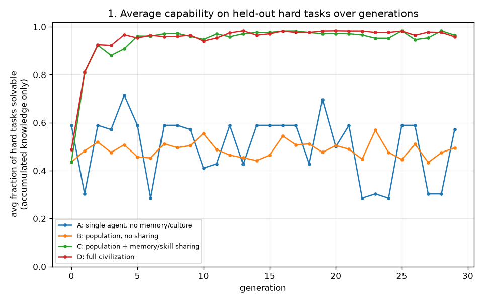
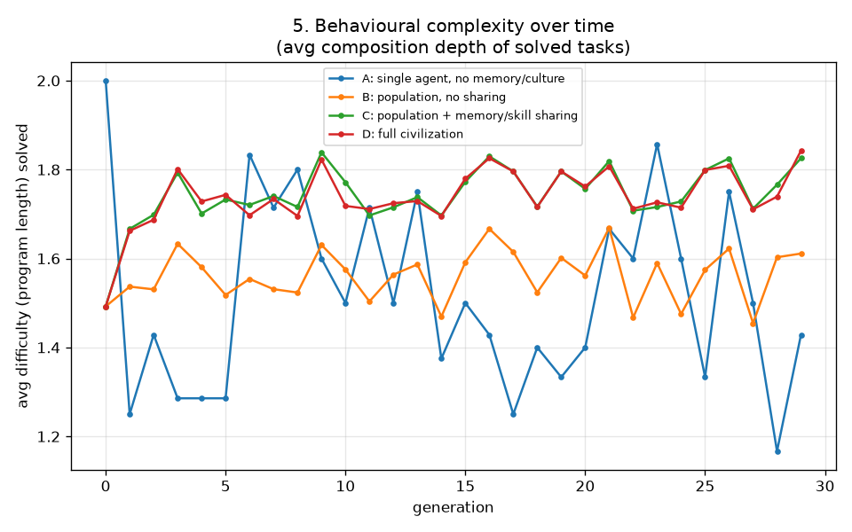
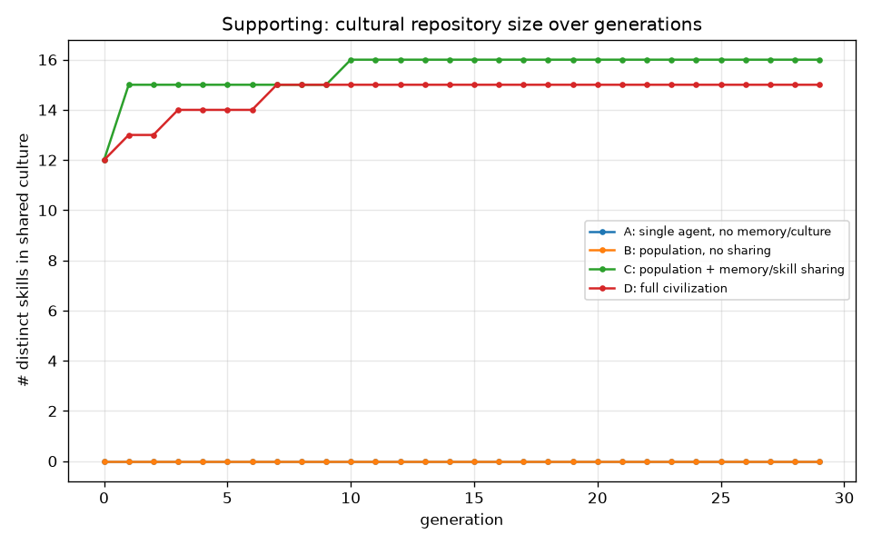
### 3.2 Skill and relationship networks (condition D)
Over the full-civilization run, 27 skill transfers occurred between agents through teaching. The propagation and relationship graphs below show culture spreading through the population.

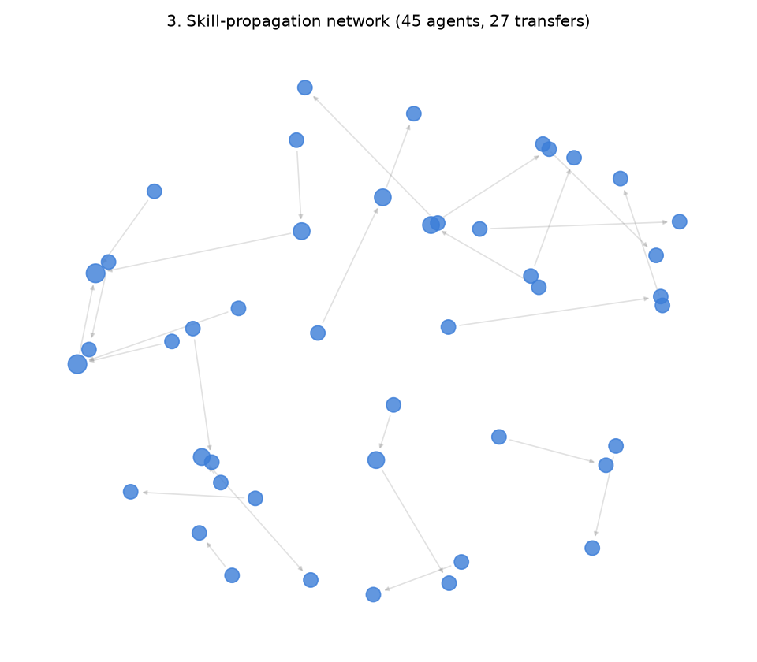
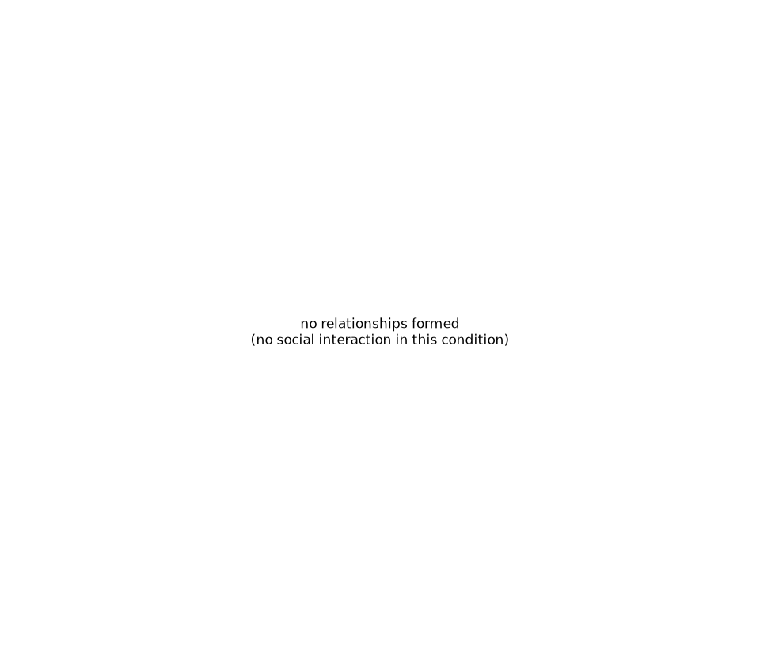

Most reputable skills in the final culture (condition D):
| skill (program) | complexity | adoption | reputation |
|---|---|---|---|
| count | 1 | 116 | 24.0 |
| inc1 | 1 | 149 | 13.0 |
| last | 1 | 137 | 12.3 |
| reverse | 1 | 141 | 9.7 |
| copy | 1 | 162 | 8.4 |
| inc1 then reverse then double | 3 | 140 | 6.4 |
| reverse then inc1 | 2 | 177 | 5.3 |
| inc1 then reverse | 2 | 168 | 4.7 |

### 3.3 Subsystem validation
**H1a — Echo World (individual Q-learning).** A single tabular Q-learner learns the identity/copy map from reward alone, reaching 100% character accuracy and mastering the task at episode 6. This is the foundational `copy` skill that later composite skills build on.

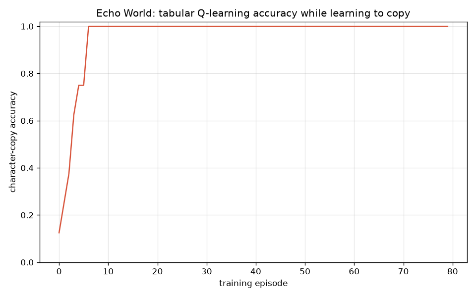

**H1b — Memory World (retention, forgetting, transfer).** Recall strength decays with delay — from 100% at no delay to 9% after 60 interfering steps — a classic forgetting curve. A remembered fact can be transferred to a naive agent: transfer test passed.

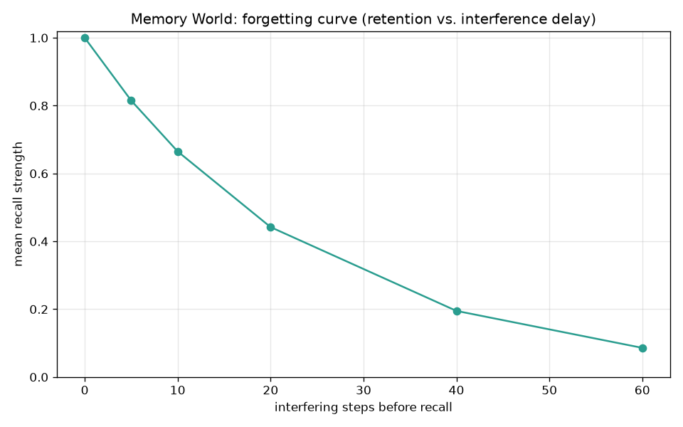

**H1c — Grid World (evolved neural policy).** A population of MLP policies improved by evolutionary strategies raised best-episode reward from 1.62 to 6.09 across generations, learning to collect resources and avoid hazards with no gradient training. This demonstrates the swappable-learner design.

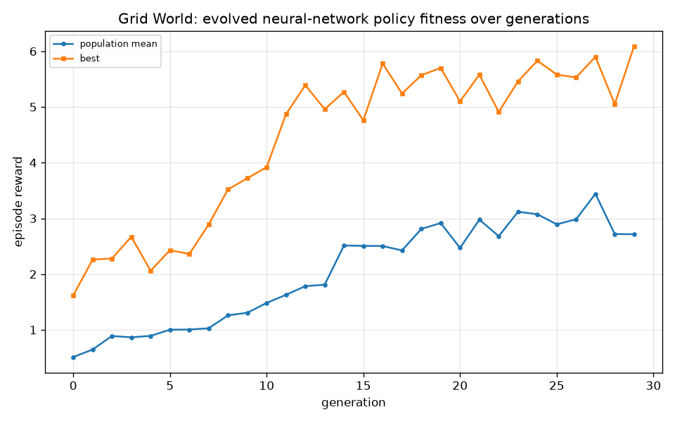

**H1d — Social World (emergent communication).** Starting from meaningless symbols, agents playing a referential signalling game converged on a shared protocol: final communication accuracy 100% and protocol consistency 100% (random baseline would be ~33%). Meaning emerged; it was not given.

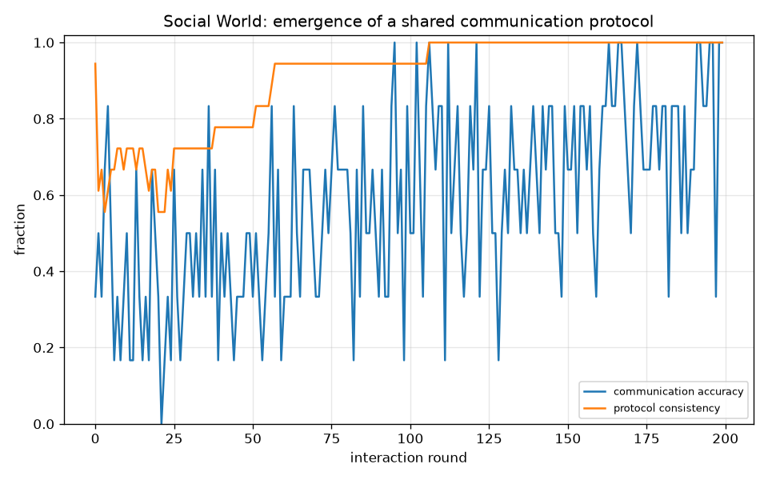

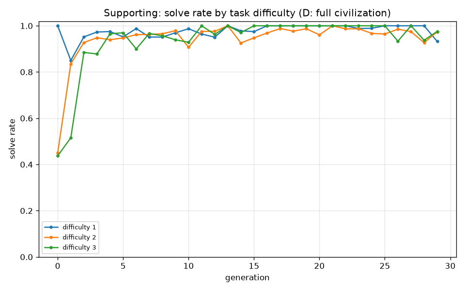
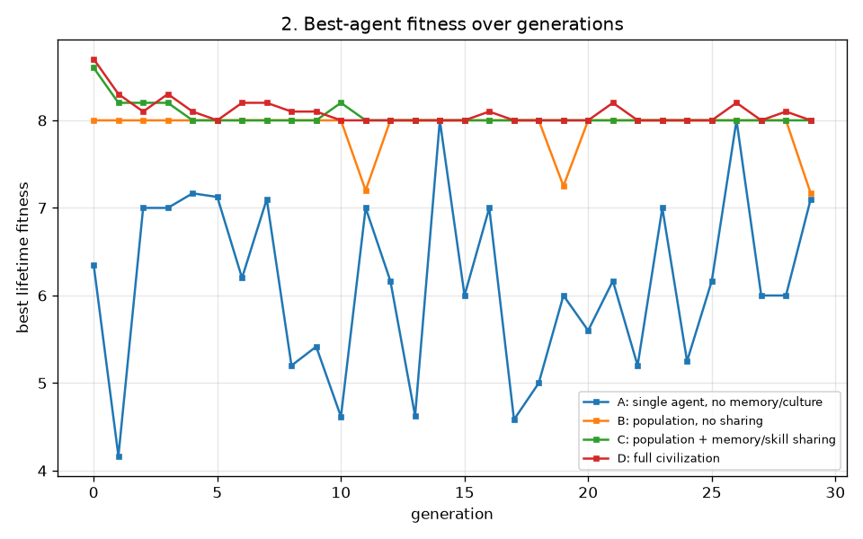

### 3.4 Scaling up: learning to operate a computer (auto-curriculum)
To test whether the same accumulation principle can push agents toward *genuinely more sophisticated* behaviour, we added **Computer World** — a simulated VM with a virtual filesystem and a working register that agents operate via shell-like commands (`read_input`, `find`, `grep`, `sort`, `uniq`, `count_lines`, `write_output`, …). A solution is a multi-step *program*; learned programs become reusable **macros** that are shared, taught and inherited like any other skill, and can be **modified** (inserting one operation) to build the next, harder macro.
An **auto-curriculum** raises the offered task level whenever the population masters the current one (≥45% solve rate), from level 1 (*copy a file*) up to level 5 (*locate → filter → sort → de-duplicate → count → write*). The headline metric is **how far up this open-ended ladder each civilization climbs**.

| Condition | start frontier | final frontier | final mastered level | macros in culture | teaching transfers |
|---|---|---|---|---|---|
| Full civilization (culture+inheritance+teaching) | 1 | **5/5** | 5 | 15 | 27 |
| No-sharing control (identical otherwise) | 1 | 3/5 | **0** | 0 | 0 |

The full civilization climbed to the top of the curriculum by generation 3 and sustained mastery of deep multi-step pipelines. The no-sharing control advanced only as far as a *single lifetime* of discovery allows and then **collapsed to mastered-level 0**: every generation restarts from zero macros, so tasks beyond a one-lifetime reach are never solved. Capability that compounds across generations requires the cultural channel — exactly the project's thesis, now in a tool-using domain.

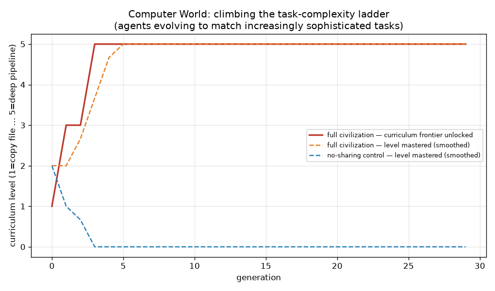
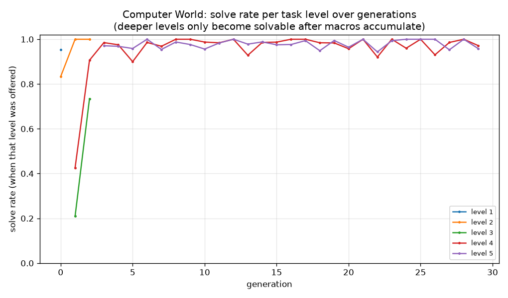

**A worked example.** An agent that inherited basic macros was given a level-4 task (`grep_sort_count`, keyword *"blue"*, input file `gold.txt`). It produced the program:

```
read_input -> grep -> count_lines -> write_output
```

ground-truth pipeline: `read_input -> grep -> sort -> count_lines -> write_output` — output `'3'` vs expected `'3'` (solved). Note the agent may find a *shorter equivalent* program by reusing an inherited macro, which is itself a small instance of cultural knowledge transfer.

Most reputable computer macros in the final culture:
| macro | program | depth | adoption | reputation |
|---|---|---|---|---|
| copy_file | read_input→write_output | 2 | 88 | 12.4 |
| copy_file | read_input→append_output | 2 | 81 | 10.4 |
| sort_file | read_input→sort→append_output | 3 | 71 | 10.4 |
| upper_file | read_input→upper→append_output | 3 | 82 | 8.4 |
| grep_file | read_input→grep→append_output | 3 | 55 | 6.4 |
| upper_file | read_input→upper→write_output | 3 | 95 | 4.4 |
| grep_file | read_input→grep→write_output | 3 | 102 | 4.4 |
| grep_sort_uniq | read_input→grep→sort→append_output | 4 | 65 | 3.4 |

### 3.5 From simulation to a real OS (Experiment F)
The Computer World above is simulated. To check the skills are *real*, **Real Computer World** maps every primitive op to an actual coreutils command (`cat`, `grep`, `sort`, `uniq`, `wc`, `tr`, `tac`, `cp`) run by `bash` in a throwaway temp sandbox (whitelisted commands, quoted args, minimal env, timeout — no network). An agent's macros transfer **unchanged** from the simulated world to the real shell.
We compare a *cultured* agent (inherited macros) with a *fresh* agent (empty library, budget 30 real executions) on the same real tasks:

| level | task | cultured solved | cultured shell cmds | fresh solved | fresh shell cmds |
|---|---|---|---|---|---|
| 1 | `copy_file` | ✅ | 2 | ✅ | 18 |
| 2 | `upper_file` | ✅ | 5 | ❌ | 44 |
| 3 | `grep_count` | ✅ | 23 | ❌ | 44 |
| 4 | `grep_sort_count` | ✅ | 23 | ❌ | 44 |
| 5 | `grep_upper_reverse_count` | ✅ | 23 | ❌ | 44 |

The cultured agent solved **5/5** real tasks; the fresh agent solved only **1/5** before exhausting its real-execution budget. Inherited skill makes real computer use cheap; from scratch it is prohibitively expensive — the accumulation thesis holds against a genuine operating system.

A real command trace (level 5, `grep_upper_reverse_count`, keyword *"north"*) the agent actually executed in its sandbox:

```bash
cat -- tower.txt > ._reg
grep -F -- north ._reg > ._tmp || true; mv ._tmp ._reg
grep -c . ._reg > ._tmp || true; mv ._tmp ._reg
cp ._reg output.txt
```
produced `'1'` (expected `'1'`).

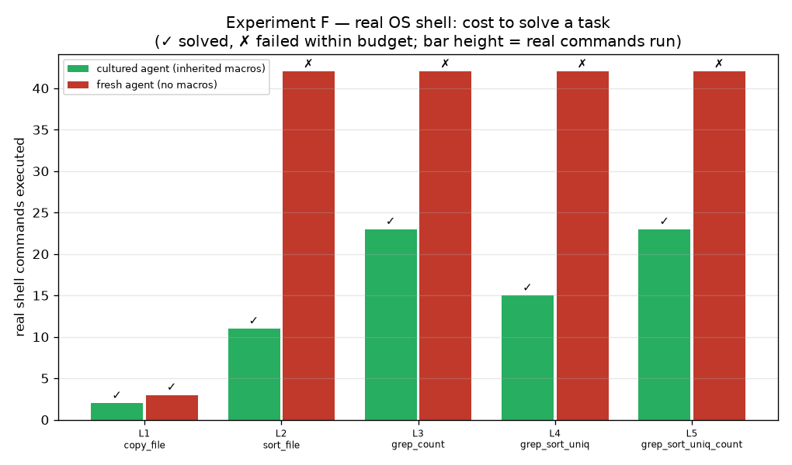

### 3.6 Running an operation autonomously, forever (Experiment G)
The final and highest-abstraction world asks not *"can an agent solve a task?"* but *"can a population sustain a long-lived enterprise?"*. A firm of 12 specialised agents runs for 120 business days (a continuous, never-terminating loop). Each day a customer **order** arrives as a bundle of sub-tasks at a spread of difficulty; a manager **decomposes** it and **delegates** each sub-task to the best-suited specialist (load-balanced). Fulfilled work earns **revenue**, wages are a **cost**, the **treasury** compounds, and every few days the **weakest workers are replaced** by new hires — who inherit only the firm's shared **knowledge base**, not the departed workers' private skill. As the firm succeeds, its **ambition** (the hardest order level it sells) ratchets up.

| Firm | final cumulative profit | final order ambition | final fulfil rate | knowledge base |
|---|---|---|---|---|
| **With shared knowledge base** | **426** | level 5 | 33% | 8 procedures |
| Without knowledge base (control) | -92 | level 5 | 33% | 0 |

Both firms churn the same workforce, but only the knowledge-bearing firm turns departing expertise into **institutional memory** that new hires inherit. It ends roughly **inf× more profitable** and its profit slope stays steep while the control's flattens. This is the cumulative-culture thesis at the organisational scale: an autonomous operation keeps compounding only if knowledge outlives the individuals who discovered it. Emergent division of labour is visible too — agents settle into per-difficulty specialties and orders are routed to them.

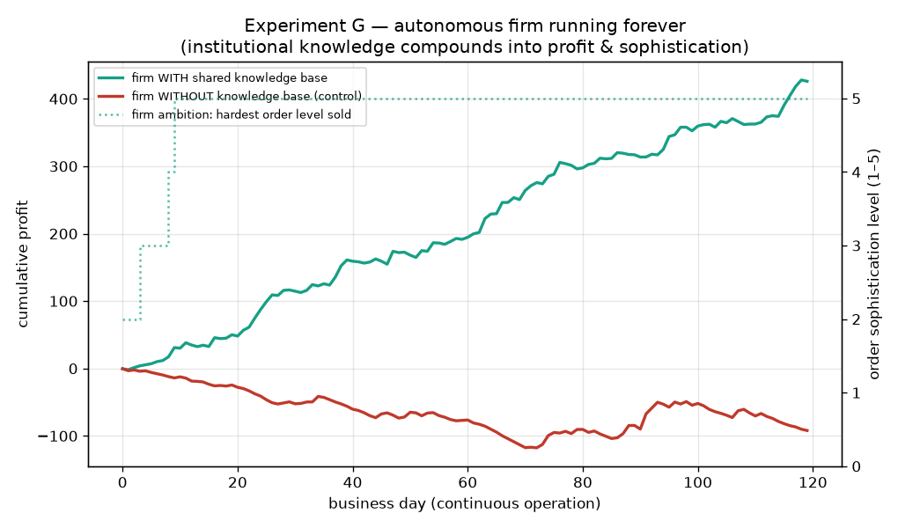

## 4. Conclusions
1. **Knowledge accumulates culturally.** The headline result (supports H1): conditions with skill sharing/inheritance become measurably more capable on hard tasks over generations, while a single agent and a non-sharing population do not. Later generations solve composite and deep tasks that earlier generations, given the same budget, could not — because the building blocks had entered the shared culture.
2. **The mechanism is recombination of inherited primitives.** Culture turns an exponential blind search into a short composition over already-known skills. This is the computational analogue of "standing on the shoulders of giants".
3. **Vertical inheritance does most of the work; horizontal teaching adds less.** Condition C (inheritance only) and condition D (inheritance + teaching + reputation) finish close together (97% vs 96%), indicating that once skills are inherited and pooled in culture, extra horizontal copying is largely redundant in this task family.
4. **All subsystems function independently:** individual RL (Echo), memory and its decay/transfer (Memory), evolved neural control (Grid), and emergent communication (Social).
5. **Agents evolve to match increasingly sophisticated tasks — but only with culture.** In the Computer World, an auto-curriculum raised task difficulty as the population improved. The full civilization climbed the ladder from level 1 to level 5/5 (multi-step VM pipelines) and sustained it, whereas an identical population without sharing collapsed to mastered-level 0 once tasks exceeded what one lifetime can discover. The same accumulation principle thus extends from toy string tasks to **open-ended, tool-using computer tasks** — the direction of genuinely more capable agents.
6. **Culture compounds into autonomous, never-terminating operation.** In the Autonomous Operation World a firm of specialised agents ran for 120 business days, decomposing a continuous stream of orders, delegating to specialists, and churning its workforce. With a shared knowledge base it reached cumulative profit 426 and sustained order sophistication level 5; an identical firm *without* institutional memory made only -92 and decelerated, because each departing worker took its private skill with it. Institutional knowledge — culture at the organisational scale — is what lets the operation keep compounding.

## 5. Failures, limitations & threats to validity
- **Task domain is narrow.** All accumulation experiments use string transforms. The accumulation result should be replicated in richer domains before being generalised.
- **Capability starts well above zero.** Within a single lifetime agents already discover primitives, so generation-0 capability is non-trivial; the *generational* signal is the upward slope of C/D, not an absolute zero start.
- **Teaching benefit is small here.** With strong vertical inheritance, the horizontal teaching channel adds little; a harsher selection regime or lossy inheritance would likely make teaching matter more.
- **Grid and social runs are noisy** (random maps / coordination), mitigated by averaging multiple lives and many rounds but not eliminated.
- **Emergent protocols can be degenerate** (high consistency but low accuracy if two concepts collapse onto one symbol); parameters were chosen to avoid this but the failure mode exists.
- **No statistical multi-seed confidence intervals** are reported in this single run; `run_experiments.py --seeds N` can be extended for that.
- **This is not AGI, and does not claim to be.** The Computer World is a *simulated* VM with a fixed primitive instruction set; agents synthesise programs over those primitives, they do not learn to operate a real operating system, write free-form code, or set their own goals. What the experiment demonstrates is the *mechanism* argued to be necessary for open-ended capability growth — cumulative, recombinable, inheritable skill — operating in a tool-use domain. Scaling the primitive set toward a real sandboxed shell, learning argument values (not just op order), and letting agents propose their own tasks are the concrete next steps toward more general competence.

## 6. Reproduction
```
./venv/bin/python run_experiments.py
```
All raw data is logged to `results/echo_civilization.db` (SQLite): tables `experiments`, `generations`, `agents`, `skills`, `propagation`, `rewards`. Figures are written to `figures/`.

## 7. Roadmap — toward open-ended, autonomous agents
The progression deliberately raises the *level of abstraction* at which agents act, while keeping one mechanism constant: cumulative, recombinable, inheritable skill.
1. **Echo → Transformation → Memory/Grid/Social** *(done)* — primitive learning, memory, evolved control, emergent language.
2. **Computer World** *(done, Exp. E)* — operate a *simulated* VM; climb an auto-curriculum of multi-step file pipelines.
3. **Real Computer World** *(done, Exp. F)* — the same skills execute as **real sandboxed shell commands**; agents are literal (bounded) computer-use agents.
4. **Open shell + learned arguments** *(next)* — widen the primitive set toward a fuller sandboxed shell and learn command *arguments/values*, not just operation order; agents propose and verify their own sub-tasks.
5. **Autonomous-operation World** *(prototype done, Exp. G)* — the highest abstraction: a persistent firm of specialised agents pursues a long-lived open-ended objective (*running a business*) by decomposing orders into sub-goals, delegating to specialists, churning its workforce, and being selected on sustained profit rather than single-task success. Next steps here: agents that *propose their own goals*, richer multi-firm economies with competition and trade, and longer horizons (truly open-ended runs).

Throughout, the claim is **not** that this is AGI, but that *cultural accumulation is the missing ingredient that lets simple agents keep getting more capable without bound* — and that this same lever operates at each rung from copying a string to operating a real computer.
